## 快速使用指导

* 文档说明                     

|属性  |时间  |
|---------|---------|
|文档版本     | 1.5.0        |
|发布日期     | 2020-12-04        |
 

### 目 录

[1 概述](#概述)

[2 创建开发环境](#创建开发环境)

[3 上传代码或数据集(Web界面方式)](#上传代码或数据集web界面方式)

[4 上传代码或数据集(SSH方式)](#上传代码或数据集ssh方式)

[5 关联数据集](#关联数据集)

[6 模型开发（SSH模式）](#模型开发ssh模式)

[7 模型开发（Jupyter Notebook模式）](#模型开发jupyter-notebook模式)

[8 模型开发（VS Code模式）](#模型开发vs-code模式)

[9 运行训练脚本（TensorFlow）](#运行训练脚本tensorflow)

[10 运行训练脚本（MindSpore）](#运行训练脚本mindspore)

[11 模型训练](#模型训练)

[12 NPU环境变量配置信息](#npu环境变量配置信息)

### 概述

本手册介绍如何进行TensorFlow、MindSpore模型训练，TensorFlow框架版本为1.15，MindSpore框架版本为1.0.1。

模型训练的流程如图所示。

1.  模型训练流程

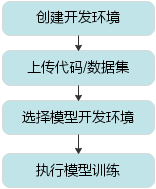

### 创建开发环境

**请通过chrome浏览器使用该平台！**

由于环境资源有限，活动参与者较多，请开发者注意如下事项：

-  创建开发环境后，请尽快使用，本次使用完请"停止"释放，下次使用可再重新创建申请，建议每次使用不超过3小时。
-  如果出现环境多人排队情况，管理员将强制停止空闲任务、超时任务。
-  建议首次创建"开发环境"时先设置设备资源为0，不占用NPU资源，先上传数据集和脚本，避免排队。

1.  开发者使用活动主办方提供的账户登录平台（http://122.224.218.50:8888/），依次选择"代码开发 -> 创建开发环境"。如图所示。

    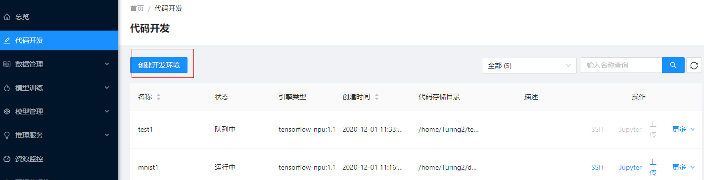

    *代码开发主要提供模型开发所依赖的docker镜像环境。*

2.  系统进入代码开发任务配置页面，配置任务信息如图2-2所示，各配置项参考如表所示。单击"立即创建"。

    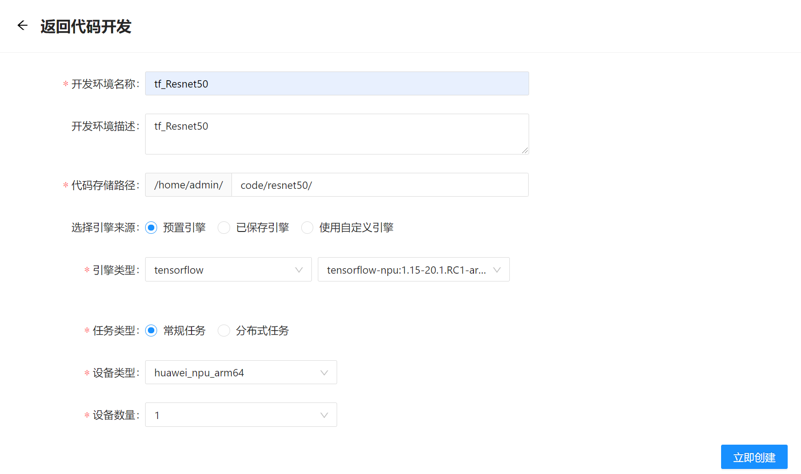

3.  配置项说明（创建开发环境）


| 选项         | 配置说明                                             |
|--------------|-----------------------------------------------------|
| 代码存储路径  | 任务代码存放路径，其中"/home/用户名/"为固定路径，用户名为当前登录用户的名称，如图示例为admin用户  |
| 设备类型     | 请选择"huawei_npu_arm64"，代表昇腾910训练设备。      |
| 设备数量     | 模型训练所需的昇腾910数量，建议选1。                 |

> [!WARNING]
> 如暂时不使用环境资源，请通过"停止"或者"暂停"按钮将任务停止或暂停，避免资源的占用，如图2-3所示。停止代码开发任务后，用户数据仍然会保存在平台中，用户下次再登录平台创建代码开发任务时(停止需重新配置任务信息)，需在"代码存储路径"选择之前的存储路径，即可关联此前已上传的代码及数据；暂停代码开发任务后，用户下次再登录平台，选择"启动"按钮，即可启动此前暂停的任务。

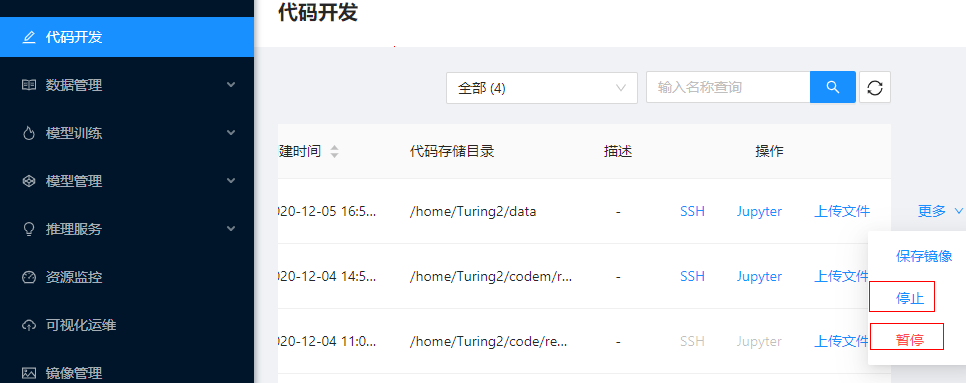


### 上传代码或数据集(Web界面方式)

1.  上传代码,用户可点击代码开发任务中的"上传"按钮，如图所示。

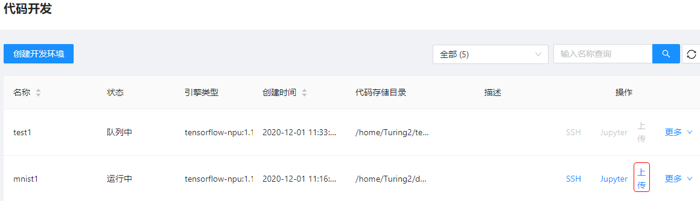

*系统弹出如图所示页面，将代码工程相关文件上传至开发环境中。支持的文件类型包括：代码文件，zip压缩包和rar压缩包。*

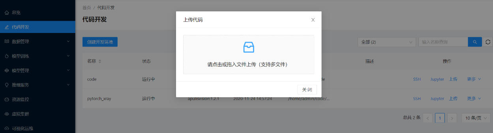

上传后用户可在此前创建代码开发环境的代码路径中查看（如/home/admin/code/Resnet50_HC，admin为登录用户名）。
> [!NOTE]
> 前提条件是：代码开发任务创建后，等待任务调度至"运行中"。


2.  上传数据集

对于数据集上传，用户可依次点击"数据管理 -> 数据集管理 -> 新增数据集"，进行Web界面上传数据集，数据集支持zip、tar、tar.gz等几个格式文件进行上传，新增数据集配置信息可参考下表进行填写。

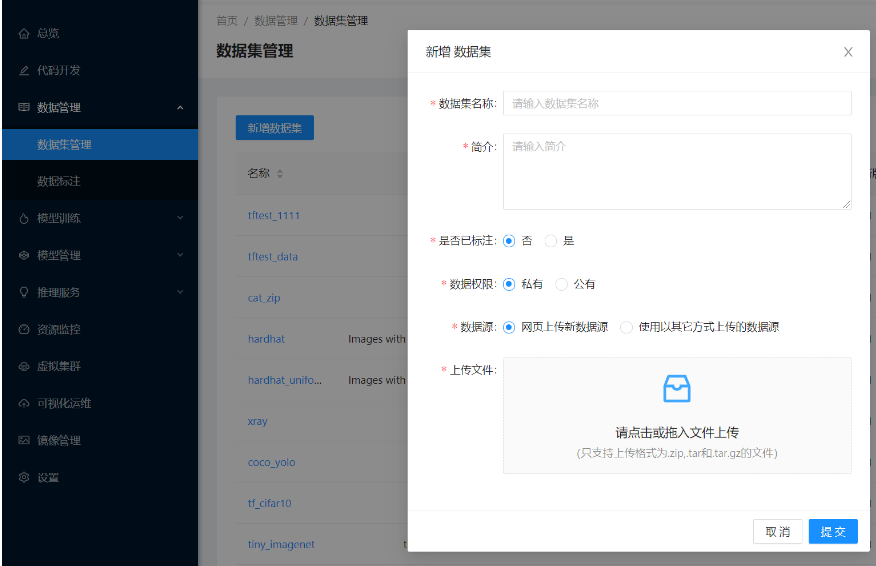

* 数据集上传配置说明

| 选项       | 配置说明                                               |
|------------|--------------------------------------------------------|
| 数据集名称 | 数据集名称                                             |
| 简介       | 数据集描述信息                                         |
| 是否已标注 | 数据是否已标注，如已标注且需要在"模型训练"模块可选该数据集，需填写"是"。 |
| 数据权限   | 数据权限配置，为了保障数据安全，如通过Web界面上传，建议选择"私有"权限。  |
| 数据源     | 数据的来源，网页上传数据源：可选择本地数据集进行，也可使用ssh的方式上传数据集|
| 上传文件   | 选择上传的数据集压缩文件                               |

上传完成后，可以在"数据集管理"页面，单击数据集名称，查看数据集的存放路径。如下图所示，cyxx为当前登录用户名。

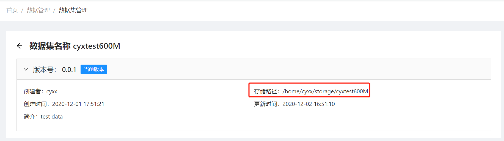

> [!TIP]
> 如需上传较大的代码工程或数据集，建议SSH方式进行上传。

### 上传代码或数据集(SSH方式)


1.  在代码开发任务列表中点击对应任务的"SSH"按钮，如下图所示，系统会弹出SSH登录信息，左键点击弹出信息即可复制SSH信息。

    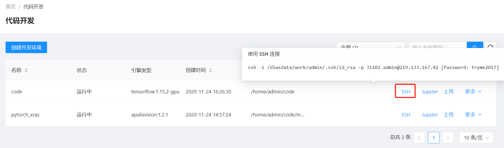

1.  根据获取的SSH信息，使用WinSCP将代码工程或数据集上传至代码开发镜像环境内（如"/home/用户名/"路径下，用户名对应当前登录的用户名），如图4-2所示配置WinSCP登录信息。

-  文件协议：选择SCP
-  端口：为获取SSH信息中对应的端口
-  用户名：为当前登录用户名
-  密码：目前固定为tryme2017

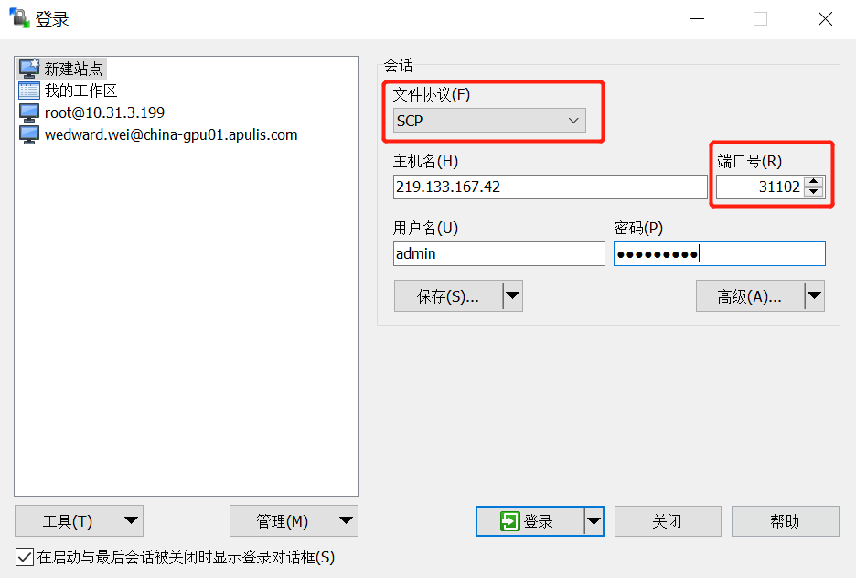


### 关联数据集

如用户通过SSH方式进行数据集上传，且需要使用菜单栏"模型训练"模块时，需要在web界面对数据集进行关联操作，方便在创建模型训练任务时选择所需的数据集。
对于关联数据集，用户可依次单击"数据管理 -> 数据集管理 -> 新增数据集"，实现数据集的关联，如下图所示。
    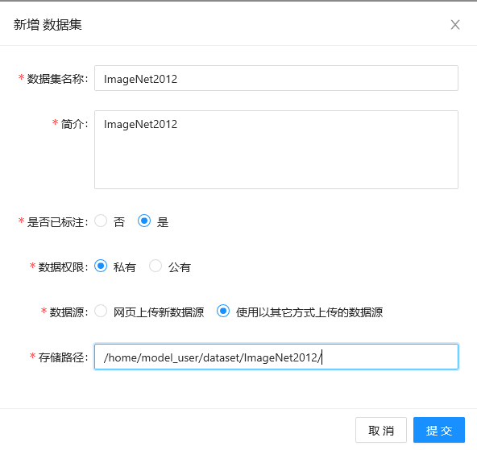

* 配置关联数据集说明

| 选项       | 配置说明                                               |
|------------|-------------------------------------------------------|
| 数据集名称 | 数据集名称。                                           |
| 简介       | 数据集描述信息。                                       |
| 是否已标注 | 请选择"是"。                                           |
| 数据权限   | 数据权限配置，为了保障数据安全，如通过Web界面上传，建议选择"私有"权限。  |
| 存储路径   | 输入通过SSH上传数据集后的存储路径。具体SSH上传后的存储路径可在代码开发中查看。|

### 模型开发

* SSH模式

用户将代码及数据集上传后，获取对应任务SSH登录信息。如图6-1所示，输入SSH信息登录代码开发镜像，平台会对应当前登录用户的环境路径，用户可通过命令行方式进行代码调试、模型训练。

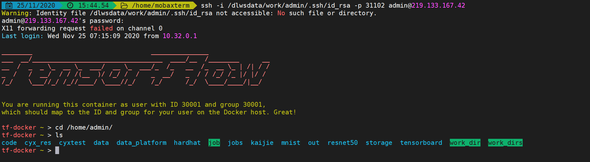

* Jupyter Notebook模式

用户可在代码开发列表中，单击"Jupyter"按钮进入Notebook环境进行模型开发。

1.  启动Jupyter

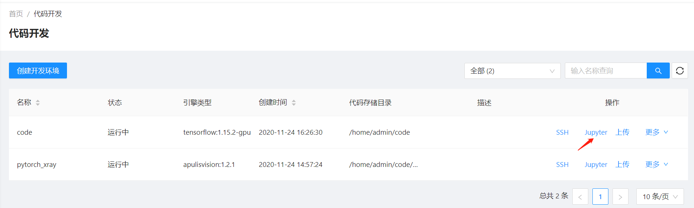

2.  Jupyter Notebook交互式界面

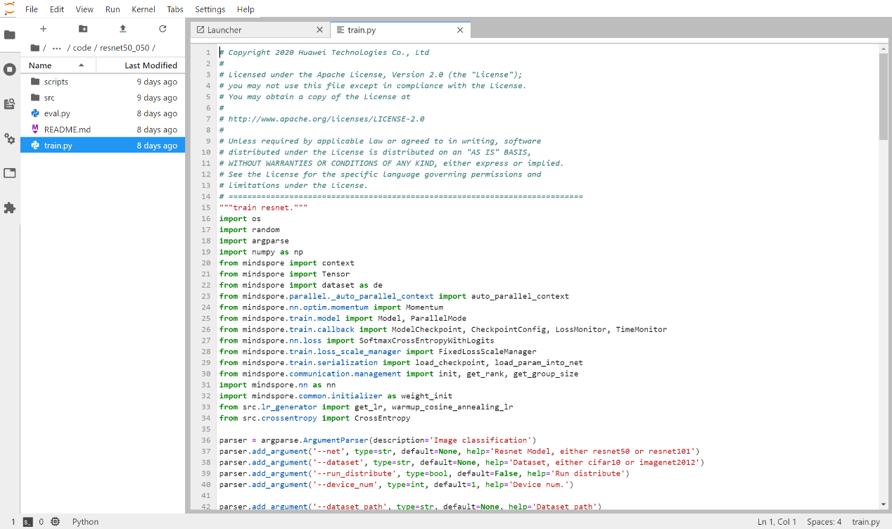

* VS Code模式

用户获取SSH信息后，也可通过配置使用VSCode进行远程链接调试，VSCode需安装Remote插件，如下图进行配置及登录对应环境。

1.  安装Remote插件

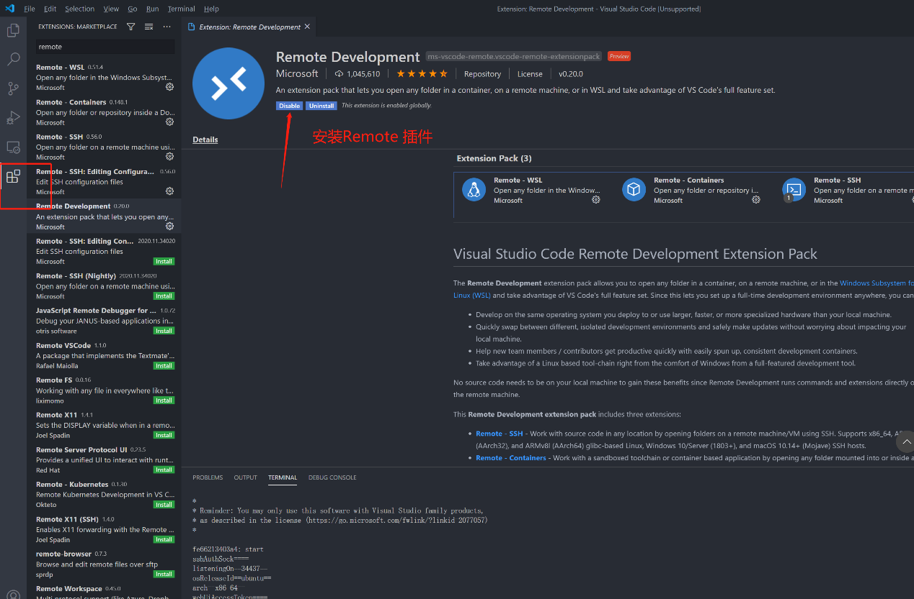

2.  添加SSH信息

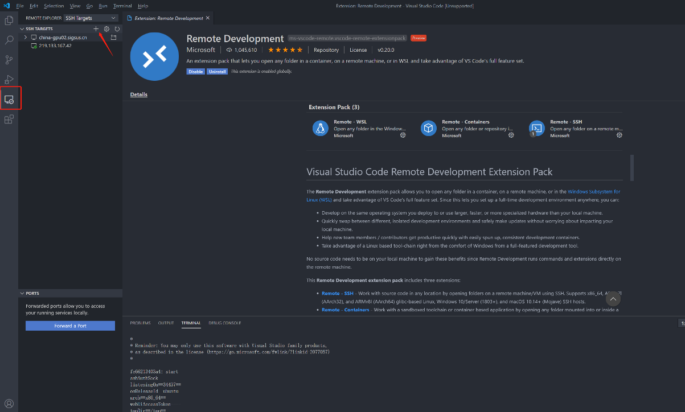

3.  输入SSH信息

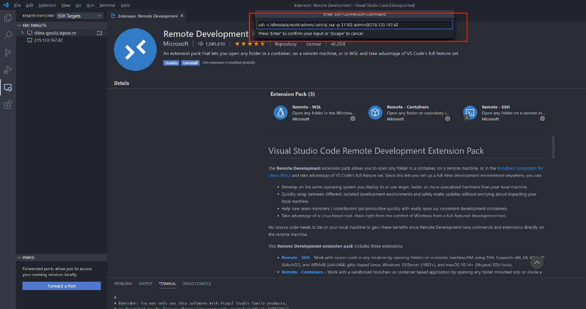

4.  打开Remote SSH环境


5.  填写对应SSH登录密码

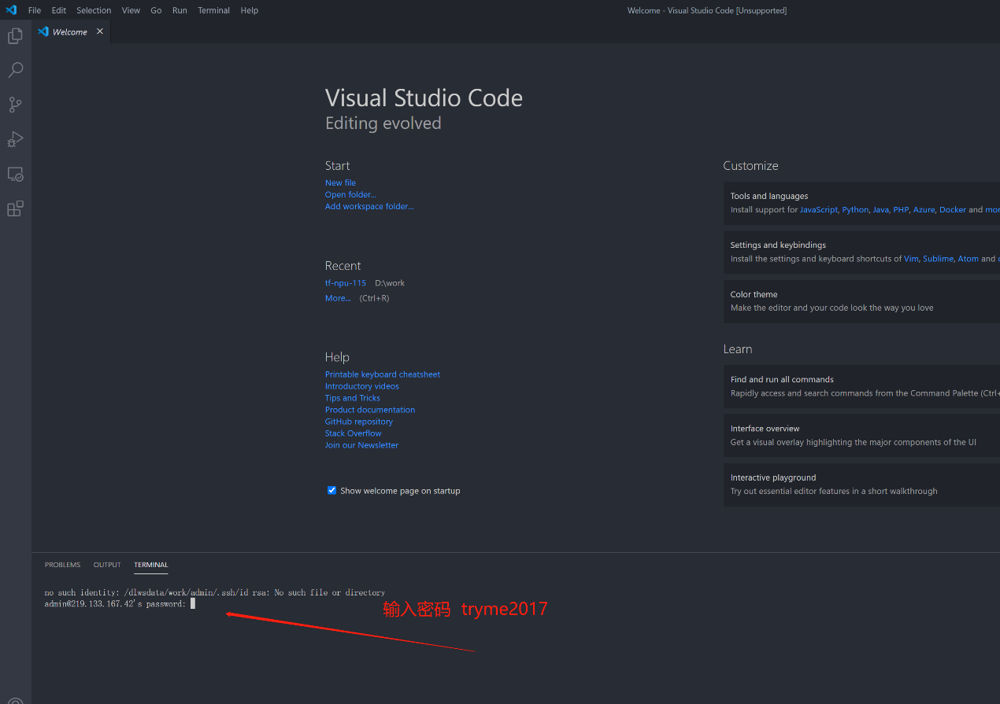

6.  选择开发目录

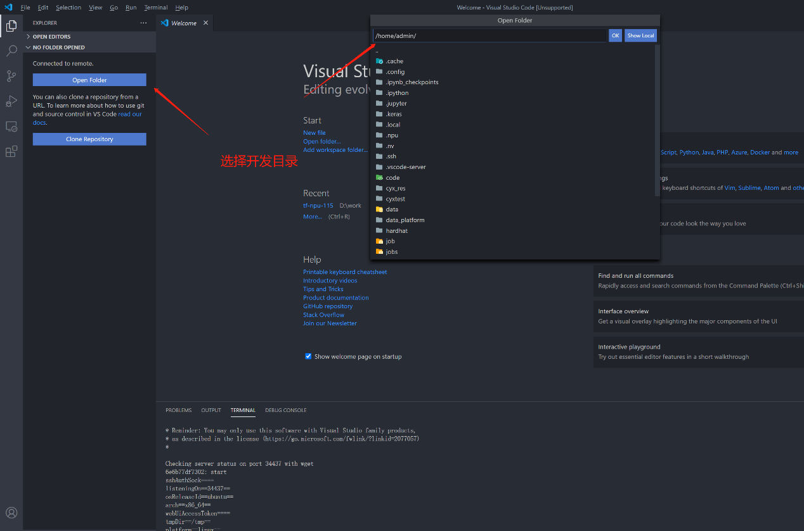

### 运行训练脚本（TensorFlow）

* 前提条件
    - 已经准备好适配TensorFlow的脚本。
    - 已经创建好开发环境，具体操作请参考2 创建开发环境。
    - 已经将代码/数据集上传至开发环境中，具体操作请参考zh-cn_topic_0297797150.xml。

* 操作步骤

    本章节以一个已迁移好的适配TensorFlow框架的Resnet50模型代码为例，介绍如何进行模型训练。

1. 打开Jupyter，请参考模型开发（Jupyter Notebook模式），启动一个Terminal，解压文件进入代码路径。
    ```bash
    cd ~/code
    unzip ModelZoo_Resnet50_HC.zip
    ```
2.  修改数据集路径(data_url)。编辑 res50_256bs_1p.py配置文件，如图所示。

    `vim ModelZoo_Resnet50_HC/00-access/src/configs/res50_256bs_1p.py`

3.  修改数据集路径(/home/{username}/dataset/tiny_imagenet)

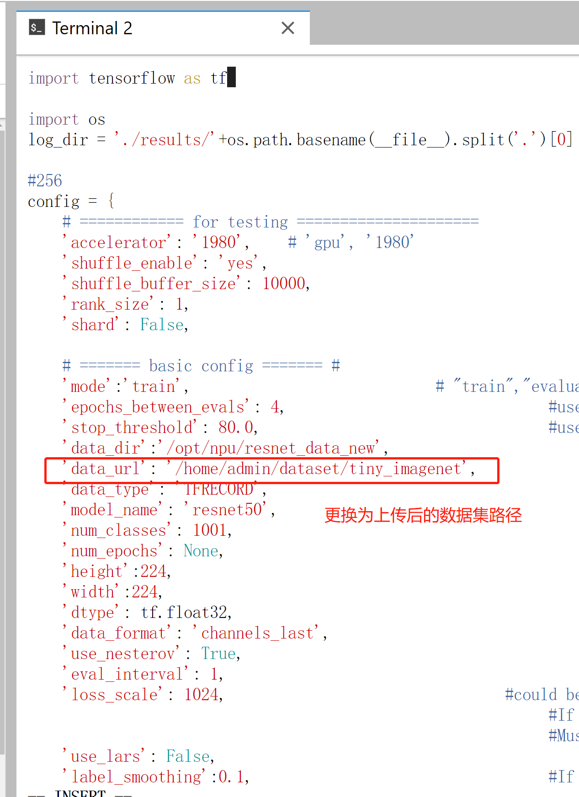

* 执行模型训练。

    *一般分配基本为每个用户只有一张NPU卡，在编辑完示例代码后直接执行如下命令即可拉起模型训练。*

    ```bash
    python ~/code/ModelZoo_Resnet50_HC/00-access/src/mains/res50.py
    \--config_file=res50_256bs_1p \--max_train_steps=1000
    \--iterations_per_loop=100 \--debug=True \--eval=False
    \--model_dir=d_solution/ckpt${DEVICE_ID}
    ```

* 训练结束后，进入模型输出路径(model_dir配置的输出路径)，即可查看对应模型文件。
    ```bash
    cd d_solution\
    ls -alt
    ```
* 模型输出路径

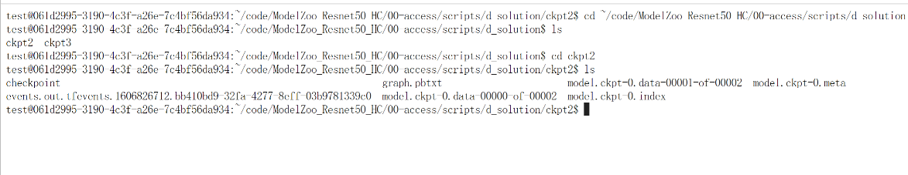

*示例命令中admin为当前登录用户，用户可根据当前登录用户名进行调整。*

- data_url：为数据集路径，data_url填写的为用户数据集保存的路径。可以通过图3-4进行查询。
- config_file：为模型配置文件
- max_train_steps：为模型训练最大步长
- model_dir：为模型输出路径
- 在调试过程中，驱动错误会存储在"/var/log/npulog/slog/"下，通常系统报错放在host-0下，对应卡的报错在device-以及device-os-\*下，对应调用的是哪一张卡，就去哪一个目录去找对应的日志，如下图所示。
- 第一次训练执行完成后，如再次启动训练任务程序会自动加载之前的权重文件，建议把输出目录清空后再次进行训练。

> 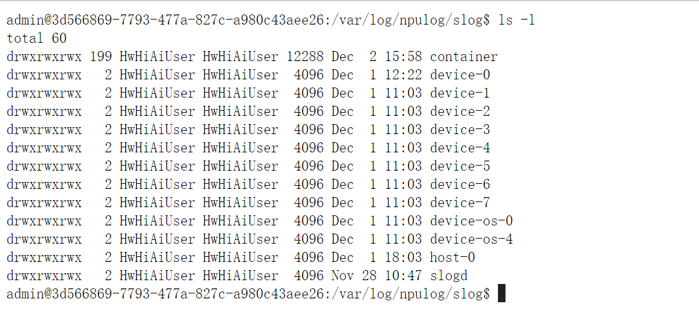


## 分布式训练（BERT-TensorFlow）

* 前提条件

    - 已经创建好开发环境，具体操作请参考2 创建开发环境。
    - 已经将bookscorpus数据集TFRecord格式上传至开发环境中。

* 操作步骤

本章节以一个从ModelZoo上下载[BERT-Base](https://www.huaweicloud.com/ascend/resources/modelzoo)模型为例，介绍如何进行BERT-Base多机多卡分布式模型训练。

1.  打开Jupyter，请参考模型开发（Jupyter Notebook模式）启动分布式开发环境，新建一个Terminal，进入代码路径\~/code/后使用unzip命令解压。
2.  进入`~/code/ModelZoo_BertBase_TF/00-access/`目录下新建train.sh文件，输入以下内容并保存。

    ```bash
    \#!/bin/bash

    export GLOBAL_LOG_LEVEL=3

    export TF_CPP_MIN_LOG_LEVEL=3

    export SLOG_PRINT_TO_STDOUT=0

    execpath=$(dirname $(realpath $0))

    IFS=\',\' read -ra NPUSARR \<\<\<\"${VISIBLE_IDS}\"

    echo \"ADD\-\--${NPUSARR\[@\]}\"

    export SOC_VERSION=Ascend910

    export HCCL_CONNECT_TIMEOUT=600

    export PRINT_MODEL=0

    export RANK_SIZE=${\#NPUSARR\[@\]}

    export DEVICE_NUM=${\#NPUSARR\[@\]}

    export JOB_ID=$DLWS_JOB_ID

    export RANK_START=0

    export RANK_INDEX=0

    export POD_NAME=${DLWS_JOB_ID}

    logpath=\~/work_dirs/distributed/$DLWS_JOB_ID/$DLWS_ROLE_IDX

    mkdir -p $logpath

    cd $logpath

    if \[ $DLWS_NUM_WORKER -gt 1 \]; then

    export POD_NAME=$DLWS_JOB_ID-worker-$DLWS_ROLE_IDX

    export SERVER_ID=${DLWS_ROLE_IDX}

    export RANK_START=$((DEVICE_NUM \* SERVER_ID))

    export RANK_SIZE=$(($DLWS_NUM_WORKER \* 8))

    fi

    export RANK_ID=$POD_NAME

    ulimit -u unlimited

    env

    export AICPU_PROFILING_MODE=false

    export PROFILING_OPTIONS=task_trace:training_trace

    export FP_POINT=bert/embeddings/GatherV2

    export
    BP_POINT=gradients/bert/embeddings/IdentityN_1\_grad/UnsortedSegmentSum+

    export
    RANK_TABLE_FILE=/home/$DLWS_USER_NAME/.npu/$DLWS_JOB_ID/hccl_tf.json

    rm -rf output kernel_meta

    INDEX=0

    export RANK_INDEX=$INDEX

    for device_phy_id in \"${NPUSARR\[@\]}\"; do

    export DEVICE_ID=$device_phy_id

    export RANK_DEVICE_INDEX=$INDEX

    INDEX=$((INDEX+1))

    python $execpath/src/pretrain/run_pretraining.py
    \--bert_config_file=$execpath/configs/bert_base_config.json
    \--max_seq_length=128 \--max_predictions_per_seq=20
    \--train_batch_size=128 \--learning_rate=1e-4 \--num_warmup_steps=10000
    \--num_train_steps=500000 \--optimizer_type=adam \--manual_fp16=True
    \--use_fp16_cls=True
    \--input_files_dir=/data/dataset/storage/bookscorpus/training
    \--eval_files_dir=/data/dataset/storage/bookscorpus/test
    \--npu_bert_debug=False \--npu_bert_use_tdt=True \--do_train=True
    \--num_accumulation_steps=1 \--npu_bert_job_start_file=None
    \--iterations_per_loop=100 \--save_checkpoints_steps=10000
    \--npu_bert_clip_by_global_norm=False \--distributed=True
    \--npu_bert_loss_scale=0 \--output_dir=./output &

    echo \"============ CMD ============\"

    echo $CMD

    echo \"============ CMD ============\"

    eval $CMD

    done

    wait
    ```

3.  进入worker-0中拉起训练脚本后，再从jupyter中新建一个terminal进入worker-1中拉起训练脚本

    ```bash
    ssh worker-0

    cd \~/code/ModelZoo_BertBase_TF/00-access/
    bash train.sh
    ssh worker-1
    cd \~/code/ModelZoo_BertBase_TF/00-access/
    bash train.sh
    ```

    - 如果进行4,8,16机分布式训练，则在创建代码开发中，选择相应的4,8,16节点数，打开jupyter并分别进入各个worker中拉起训练脚本
    `ssh worker-0 ... worker-4 \... worker-8 ... worker-16 ... bash train.sh`

    - input_files_dir：为训练集数据集路径，训练集格式为tfrecord。
    - eval_files_dir: 为测试集数据集路径。
    - 模型输出路径为：\~/work_dirs/distributed/$DLWS_JOB_ID/$DLWS_ROLE_IDX。
    - 使用预置模型启动多机多卡，worker节点命令添加
    `cd /data/model-gallery/models/npu/tensorflow/bert_base && bash train.sh --data_path /data/dataset/storage/bookscorpus`

### GPU模型训练（Lenet-TensorFlow）

* 前提条件

-   已经创建好开发环境。

* 操作步骤

本章节以一个从gitee上拉取[lenet-tensorflow2.x](https://gitee.com/Stan.Xu/lenet-tensorflow2)模型为例，介绍如何进行GPU模型训练。

1. 打开Jupyter，请参考7 模型开发（Jupyter Notebook模式），启动一个Terminal，进入代码路径\~/code/后使用进行代码克隆。

    ```bash
    git clone https://gitee.com/Stan.Xu/lenet-tensorflow2
    cd lenet-tensorflow2
    ```

2. 执行tf-lenet.py即可启动训练。

    `python tf-lenet.py`

### 运行训练脚本（MindSpore）

*该流程与运行训练脚本（TensorFlow）类似，此处只针对差异进行介绍。*

* 前提条件

- 已经准备好适配MindSpore的脚本。
- 已经创建好开发环境，具体操作请参考2 创建开发环境。
- 经将代码/数据集上传至开发环境中，具体操作请参考zh-cn_topic_0297797150.xml。

* 操作步骤

本章节以一个已迁移好的适配MindSpore框架的Resnet模型代码为例，介绍如何进行模型训练。
进入脚本所在路径，启动训练，此处以cifar10数据集为例。

`cd \~/code/mindspore/model_zoo/official/cv/resnet/scripts bash run_standalone_train.sh resnet50 cifar10 ~/dataset/cifar10/`

本示例训练脚本run_standalone_train.sh 中将标准输出存入train/log文件中。

如果需要输出到终端上，需要进入run_standalone_train.sh中去掉>重定向命令。

如果需要修改模型文件的存放路径，则需要进入项目src文件夹下，修改对应的config.py文件，训练结束后可到对应路径下载对应输出。


用户在调试MindSpore模型时，如果前一次训练任务异常退出，需要清理环境相关进程（本示例需要清理如下两个相关的进程），然后再次拉起训练脚本。

```bash
ps -aux |grep python
python /usr/local/lib/python3.7/site-packages/mindspore/_extends/remote/kernel_build_server_ascend.py
python /home/admin/code/ms-resnet/train.py --net=resnet50 \
--dataset=cifar10 --run_distribute=True --device_num=2    \
--dataset_path=/data/dataset/storage/cifar10/cifar10-bin/
```

清除训练脚本进程，执行kill 进程id 清除相关进程

`ps -aux \|grep train \|awk \'{print $2}\' \|xargs -n 1 kill -9`

清除MindSpore进程

`ps -aux \|grep mindspore \|awk \'{print $2}\' \|xargs -n 1 kill -9`

停止训练任务，手动执行kill命令关闭训练进程。

## 分布式训练（YOLOv3-MindSpore）

* 前提条件

    - 已经创建好开发环境，具体操作请参考2 创建开发环境。
    - 已经将coco2014数据集上传至开发环境中。

* 操作步骤

本章节以一个从ModelZoo上下载[YOLOv3](https://www.huaweicloud.com/ascend/resources/modelzoo)模型为例，介绍如何进行YOLOv3多机多卡分布式模型训练。

1.  打开Jupyter，请参考7 模型开发（Jupyter Notebook模式）启动分布式开发环境，新建一个Terminal，进入代码路径\~/code/后使用unzip命令解压。
2.  进入`~/code/yolov3_darknet53`目录下新建train.sh文件，输入以下内容并保存。

```bash
\#!/bin/bash
export GLOBAL_LOG_LEVEL=3export TF_CPP_MIN_LOG_LEVEL=3export
SLOG_PRINT_TO_STDOUT=0execpath=$(dirname $(realpath $0))IFS=','
read -ra NPUSARR <<<"${VISIBLE_IDS}"
echo "ADD---${NPUSARR[@]}"
export SOC_VERSION=Ascend910
export HCCL_CONNECT_TIMEOUT=600
export PRINT_MODEL=0
export RANK_SIZE=${#NPUSARR[@]}
export DEVICE_NUM=${#NPUSARR[@]}
export JOB_ID=$DLWS_JOB_ID
export RANK_START=0
export RANK_INDEX=0
export POD_NAME=${DLWS_JOB_ID}logpath=~/work_dirs/distributed/$DLWS_JOB_ID/$DLWS_ROLE_IDXmkdir -p $logpathcd $logpath 
if [ $DLWS_NUM_WORKER -gt 1 ]; then
export POD_NAME=$DLWS_JOB_ID-worker-$DLWS_ROLE_IDX 
export SERVER_ID=${DLWS_ROLE_IDX} 
export RANK_START=$((DEVICE_NUM*SERVER_ID)) 
export RANK_SIZE=$(($DLWS_NUM_WORKER \* 8))
fi
export RANK_ID=$POD_NAMEulimit -u unlimitedenv
export RANK_TABLE_FILE=/home/$DLWS_USER_NAME/.npu/$DLWS_JOB_ID/hccl_ms.jsonrm
-rf output kernel_metaINDEX=0
export RANK_INDEX=$INDEX
for((device_phy_id = 0; device_phy_id < ${DEVICE_NUM}; device_phy_id++));
do 
export RANK_ID=$((RANK_START + device_phy_id)) 
export RANK_INDEX=$((RANK_START + device_phy_id)) 
export DEVICE_ID=$device_phy_id 
export DEVICE_INDEX=$device_phy_id 
export RANK_DEVICE_INDEX=$device_phy_id 
python /home/admin/code/yolov3_darknet53/train.py --is_distributed=1 \
    --lr=0.01 --data_dir=/data/dataset/storage/coco/2014/raw \
    --pretrained_backbone=/data/dataset/storage/pretrained_models/darknet_weights/darknet53_backbone.ckpt \
    --max_epoch=1 & echo "============ CMD ============" echo $CMD echo \
    "============ CMD ============" eval $CMDdonewait
```

3. 进入worker-0中拉起训练脚本后，再从jupyter中新建一个terminal进入worker-1中拉起训练脚本

```bash
ssh worker-0
cd ~/code/yolov3_darknet53
bash train.sh
ssh worker-1
cd ~/code/yolov3_darknet53
bash train.sh
```
- data_dir：为训练集数据集路径，训练集格式为MSRecord。
- 模型输出路径为：`~/work_dirs/distributed/$DLWS_JOB_ID/$DLWS_ROLE_IDX`。
- 如果进行4,8,16机分布式训练，则在创建代码开发中，选择相应的4,8,16节点数，打开jupyter并分别进入各个worker中拉起训练脚本

    `ssh worker-0 ... worker-4 \... worker-8 ... worker-16 ... bash train.sh`

## 模型训练

针对此前代码开发中调试完成的训练脚本，配置模型训练任务，任务结束后自动释放NPU资源，避免了资源浪费。

* 前提条件

    - 代码/数据集已上传至平台，具体操作可参考zh-cn_topic_0297797150.xml。
    - 模型训练脚本已完成调试，具体操作可参考zh-cn_topic_0297797124.xml。

* 操作步骤

    1. 依次选择"模型训练 -> 模型训练->创建训练任务"，进入训练作业配置页面，配置任务信息如图11-1所示，各配置项参考下填写。完成后点击"立即创建"开始训练作业。
    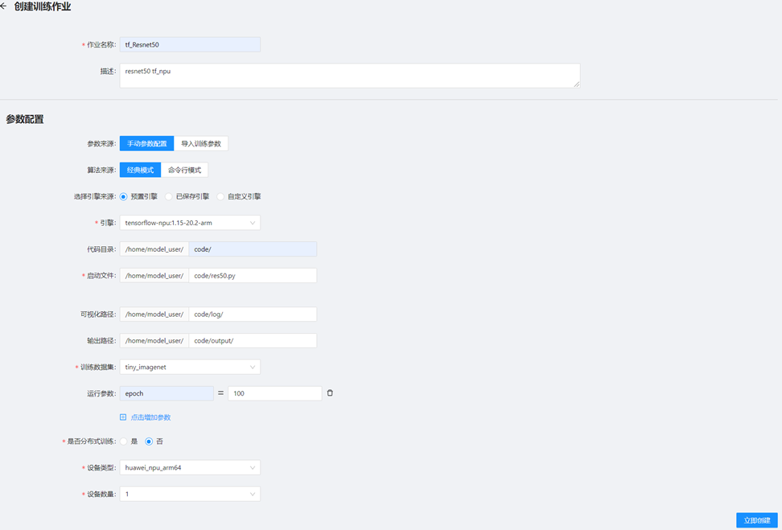

    *示例路径中model_user为当前登录用户。*

    2. 配置项说明（创建训练作业-经典模式）

    | 选项           | 配置说明                                           |
    |----------------|---------------------------------------------------|
    | 作业名称       | 训练作业名称。                                     |
    | 描述           | 训练作业描述。                                     |
    | 代码目录       | 选填，模型训练代码所在路径。                       |
    | 启动文件       | 模型训练启动脚本。                                 |
    | 可视化路径     | 选填，模型训练日志输出路径。                       |
    | 输出路径       | 选填，模型文件输出路径。|
    | 训练数据集     | 训练数据集，如为用户私有数据集且通过SSH上传，需要进行关联数据集操作，可参考3.3。 |
    | 运行参数       | 模型训练可自定义相关参数传参，如上图示例调整训练epoch，用户的训练脚本可直接使用运行参数的变量。  |
    | 是否分布式训练 | 本次活动分配给用户都,是单卡资源，暂无法进行多机分布式训练，请选择"否"。 |
    | 设备类型       | 请选择"huawei_npu_arm64"，代表昇腾910训练设备。    |
    | 设备数量       | 模型训练所需的昇腾910数量,建议选"1"（如训练任务不需要NPU资源，可选"0"）。  |

    > [!NOTE]
    > 输出路径对应变量为output_path，数据集对应变量为data_path，如填写需训练脚本中解析该变量，如上图示例，对应代码开发中用户直接拉起训练的指令如下：（示例中epoch为用户定义的运行参数，更多运行参数用户可根据训练脚本所需填写）
    `python /home/model_user/code/res50.py  --data_path <数据集路径>  --epoch 100  --output_path /home/model_user/code/output/`

    3. 创建训练作业-命令行模式

        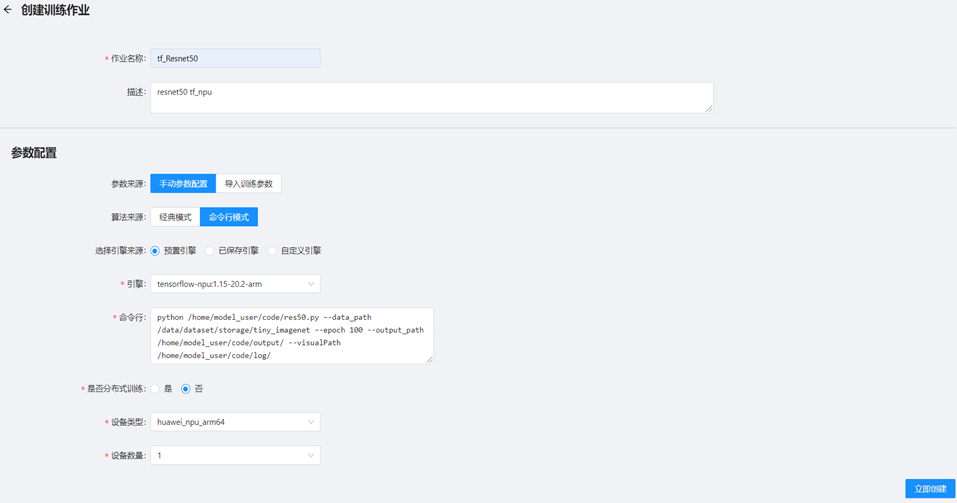

        *命令行模式中需要的路径地址为"代码开发"任务中配置的路径。*

    4. 任务创建完成并等待任务状态变为"运行中"，单击任务列表中的作业名称进入模型训练详情界面，可看到模型训练过程日志的实时输出，如下图所示。

    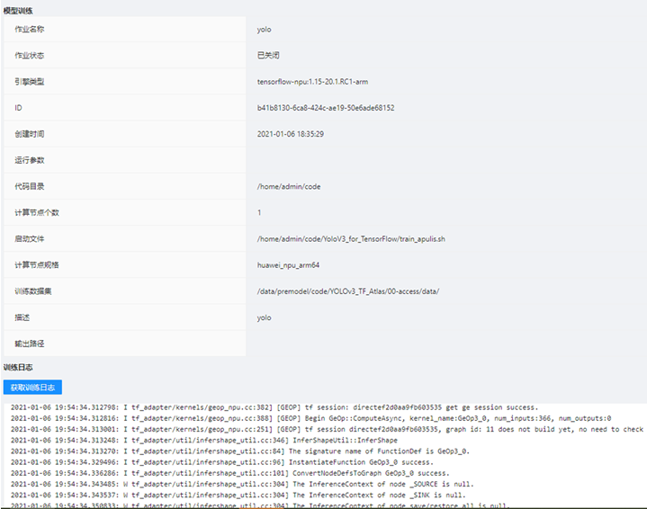

    5.  用户可对训练任务参数进行保存，下次创建模型训练任务时，"参数来源"可选择"导入训练参数"，如下图6-3所示进行训练参数保存。

    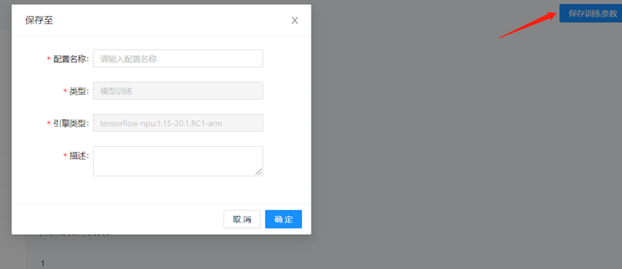

**保存模型训练参数配置说明：**

-   配置名称：训练参数保存名称，便于下次选择。
-   类型：默认为模型训练。
-   引擎类型：默认为该模型训练任务所选引擎。
-   描述：描述信息。


### NPU环境变量配置信息

-   查看当前使用的device设备id号，如图所示，device_id为3。

    *`env \| grep VIS`：查看当前可使用设备号，默认由平台分配。*

    > 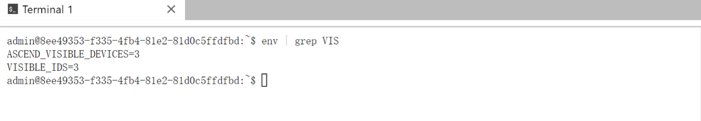

-   设置HCCL通信时间（"\~/.npu/$DLWS_JOB_ID/train.sh"中配置）。

    `export HCCL_CONNECT_TIMEOUT=200`

-   NPU驱动日志输出路径为 `/var/log/npulog/slog`
    ```bash
    host-0      # 代表该节点所有NPU的驱动报错日志；
    device-n    # 代表第n张NPU卡的驱动报错日志；
    device-os-0 # 代表第0-3张NPU卡的驱动报错日志；
    device-os-4 # 代表第4-7张NPU卡的驱动报错日志。
    ```
-   NPU驱动日志打印到标准输出（"\~/.npu/$DLWS_JOB_ID/train.sh"中配置）。

    `export SLOG_PRINT_TO_STDOUT=1`
    *设置此变量会默认以debug模式输出日志，NPU驱动不会再写入log日志到`/var/log/npulog/slog`下*
-   设置全局日志级别。
-   Tensorflow的日志控制环境变量（"\~/.npu/$DLWS_JOB_ID/train.sh"中配置）
    ```bash
    export GLOBAL_LOG_LEVEL=3
    export TF_CPP_MIN_LOG_LEVEL=3
    export SLOG_PRINT_TO_STDOUT=0

    GLOBAL_LOG_LEVEL取值范围说明如下：
    0：对应DEBUG级别。
    1：对应INFO级别。
    2：对应WARNING级别。
    3：对应ERROR级别。
    4：对应NULL级别。
    ```
-   Mindspore的日志控制环境变量（"/var/log/npu/conf/slog/slog.conf"中配置）

    ```bash
    #note, 0:debug, 1:info, 2:warning, 3:error, 4:null(no output log),
    default(3)
    global_level=3
    # Event Type Log Flag, 0:disable, 1:enable, default(1)
    enableEvent=0
    ```
-   日志文档等级可介绍：<https://support.huawei.com/enterprise/zh/doc/EDOC1100180794/6b3fae3>
