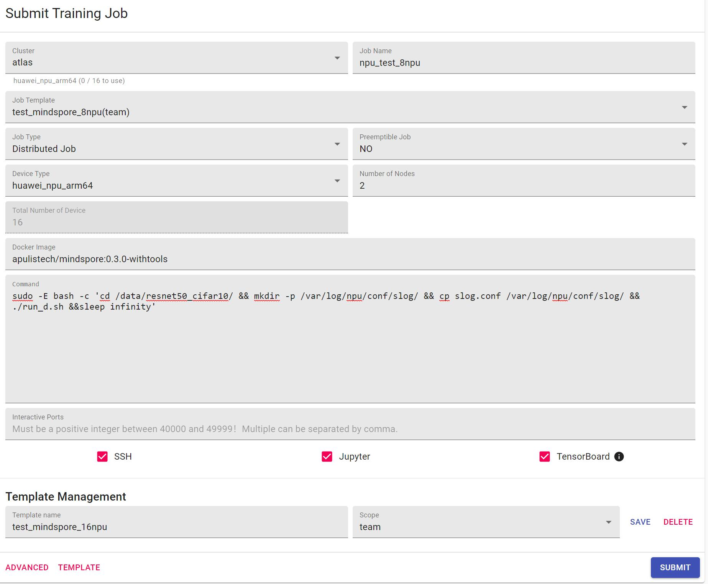
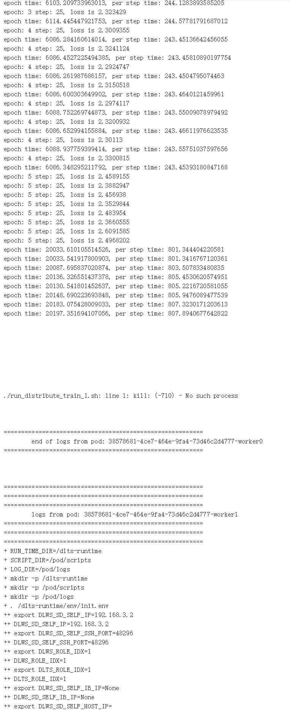
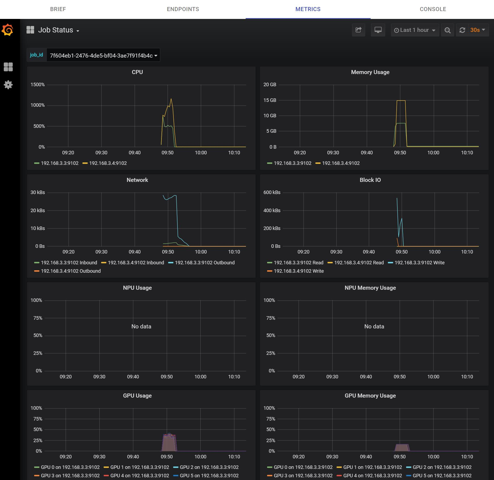
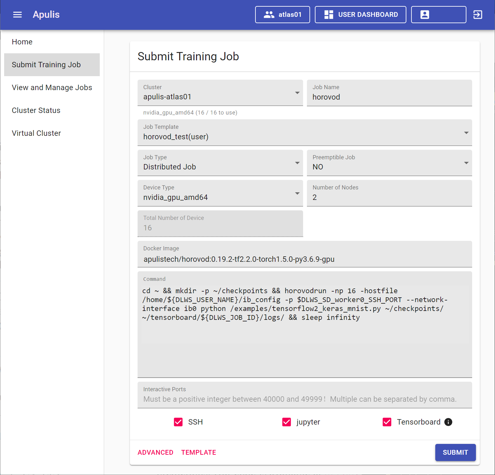
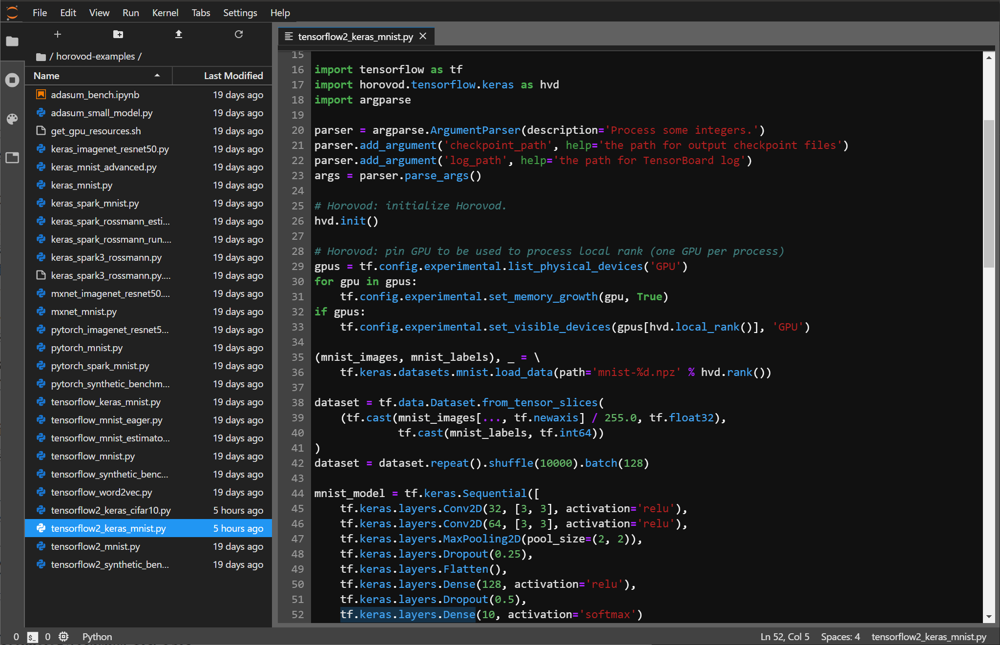
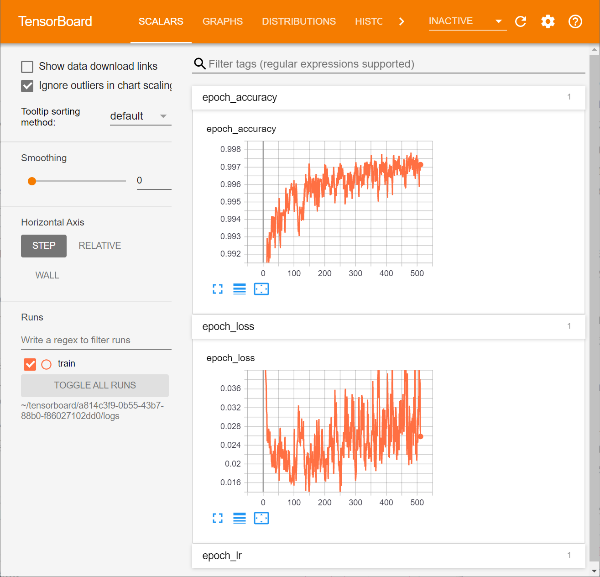

# 鏊立人工智能开放平台训练任务指南

[TOC]

## 华为昇腾(NPU)训练任务

### 系统环境要求

- Docker镜像系统：`Ubuntu 18.04 `
- 驱动版本：`1.72.T2.100.B020`
- 设备环境：华为Atlas服务器

### 使用MindSpore训练任务
- MindSpore版本：0.3.0
- 训练代码：开源示例 resnet50_cifar10, [代码地址](https://gitee.com/apulis/apulis_platform/example)；
- 数据集：Cifar10:[数据集下载链接](http://www.cs.toronto.edu/~kriz/cifar.html)；
- MindSpore所使用的hccl代码,下面直接使用多机多NPU的`json`代码展示：
```json
{
    "board_id": "0x0020",
    "chip_info": "910",
    "deploy_mode": "lab",
    "group_count": "1",
    "group_list": [
        {
            "device_num": "16",
            "server_num": "2",
            "group_name": "",
            "instance_count": "16",
            "instance_list": [
                {
                    "devices": [{"device_id": "0","device_ip": "192.168.10.1"}],
                    "rank_id": "0",
                    "server_id": "192.168.3.6"
                },
                {
                    "devices": [{"device_id": "1","device_ip": "192.168.20.1"}],
                    "rank_id": "1",
                    "server_id": "192.168.3.6"
                },
                {
                    "devices": [{"device_id": "2","device_ip": "192.168.30.1"}],
                    "rank_id": "2",
                    "server_id": "192.168.3.6"
                },
                {
                    "devices": [{"device_id": "3","device_ip": "192.168.40.1"}],
                    "rank_id": "3",
                    "server_id": "192.168.3.6"
                },
                {
                    "devices": [{"device_id": "4","device_ip": "192.168.10.2"}],
                    "rank_id": "4",
                    "server_id": "192.168.3.6"
                },
                {
                    "devices": [{"device_id": "5","device_ip": "192.168.20.2"}],
                    "rank_id": "5",
                    "server_id": "192.168.3.6"
                },
                {
                    "devices": [{"device_id": "6","device_ip": "192.168.30.2"}],
                    "rank_id": "6",
                    "server_id": "192.168.3.6"
                },
                {
                    "devices": [{"device_id": "7","device_ip": "192.168.40.2"}],
                    "rank_id": "7",
                    "server_id": "192.168.3.6"
                },
                {
                    "devices": [{"device_id": "0","device_ip": "192.168.10.3"}],
                    "rank_id": "8",
                    "server_id": "192.168.3.2"
                },
                {
                    "devices": [{"device_id": "1","device_ip": "192.168.20.3"}],
                    "rank_id": "9",
                    "server_id": "192.168.3.2"
                },
                {
                    "devices": [{"device_id": "2","device_ip": "192.168.30.3"}],
                    "rank_id": "10",
                    "server_id": "192.168.3.2"
                },
                {
                    "devices": [{"device_id": "3","device_ip": "192.168.40.3"}],
                    "rank_id": "11",
                    "server_id": "192.168.3.2"
                },
                {
                    "devices": [{"device_id": "4","device_ip": "192.168.10.4"}],
                    "rank_id": "12",
                    "server_id": "192.168.3.2"
                },
                {
                    "devices": [{"device_id": "5","device_ip": "192.168.20.4"}],
                    "rank_id": "13",
                    "server_id": "192.168.3.2"
                },
                {
                    "devices": [{"device_id": "6","device_ip": "192.168.30.4"}],
                    "rank_id": "14",
                    "server_id": "192.168.3.2"
                },
                {
                    "devices": [{"device_id": "7","device_ip": "192.168.40.4"}],
                    "rank_id": "15",
                    "server_id": "192.168.3.2"
                }
            ]
        }
    ],
    "para_plane_nic_location": "device",
    "para_plane_nic_name": [
        "eth0",
        "eth1",
        "eth2",
        "eth3",
        "eth4",
        "eth5",
        "eth6",
        "eth7"
    ],
    "para_plane_nic_num": "8",
    "status": "completed"
}
```

以上代码是两台服务器16张NPU的情况下所使用的`json`文件，可以注意到在MindSpore中，要求每张NPU的任务使用一个独立的`rankid`.

在0.3.0版本的代码中，使用resnet50_cifar10进行多机多NPU的实验，原代码有需要修改的地方，在config.py第42行中，将

```python
device_num = int(os.getenv("DEVICE_NUM"))
```
修改为
```python
device_num = int(os.getenv("RANK_SIZE"))
```

此外，由于原训练脚本是为单台服务器8张NPU设计的，使用16张NPU训练需要对训练脚本进行修改：

* 原始训练脚本地址为：[训练脚本地址](https://gitee.com/mindspore/mindspore/blob/r0.3/example/resnet50_cifar10/run_distribute_train.sh)
* 经过修改后的训练脚本：

```shell
export LD_LIBRARY_PATH=/usr/local/lib/:/usr/lib/:/usr/local/Ascend/fwkacllib/lib64/:/usr/local/Ascend/driver/lib64/common/:/usr/local/Ascend/driver/lib64/driver/:/usr/local/Ascend/add-ons/
export PYTHONPATH=$PYTHONPATH:/usr/local/Ascend/opp/op_impl/built-in/ai_core/tbe:/code
export PATH=$PATH:/usr/local/Ascend/fwkacllib/ccec_compiler/bin
export ASCEND_OPP_PATH=/usr/local/Ascend/opp


if [ $# != 2 ]
then
    echo "Usage: sh run_distribute_train.sh [MINDSPORE_HCCL_CONFIG_PATH] [DATASET_PATH]"
exit 1
fi

get_real_path(){
  if [ "${1:0:1}" == "/" ]; then
    echo "$1"
  else
    echo "$(realpath -m $PWD/$1)"
  fi
}

PATH1=$(get_real_path $1)
PATH2=$(get_real_path $2)

if [ ! -f "$PATH1" ]
then
    echo "error: MINDSPORE_HCCL_CONFIG_PATH=$PATH1 is not a file"
exit 1
fi

if [ ! -d "$PATH2" ]
then
    echo "error: DATASET_PATH=$PATH2 is not a directory"
exit 1
fi

ulimit -u unlimited
export DEVICE_NUM=8
export RANK_SIZE=16
export MINDSPORE_HCCL_CONFIG_PATH=$PATH1

for((i=0; i<${DEVICE_NUM}; i++))
do
    export DEVICE_ID=$i
    export RANK_ID=$i
    rm -rf ./train_parallel$i
    mkdir ./train_parallel$i
    cp *.py ./train_parallel$i
    cp *.sh ./train_parallel$i
    cd ./train_parallel$i || exit
    echo "start training for rank $RANK_ID, device $DEVICE_ID"
    env > env.log
    python train.py --do_train=True --run_distribute=True --device_num=$DEVICE_NUM --dataset_path=$PATH2 &
    cd ..
done

trap "trap - SIGTERM && kill -- -$$" SIGINT SIGTERM EXIT
wait
```

其中`RANK_SIZE`需要改成16，和上面对dataset.py的修改对应，同样如果是共享盘内执行，需要确保代码的执行目录互相分开，避免并发写入报错。  
主要修改的就是上述`mkdir ./train_parallel$i`相关的代码。  
最后的`trap "trap - SIGTERM && kill -- -$$" SIGINT SIGTERM EXIT`是为了防止在平台启动进程后，平台无法杀掉镜像，而进行的系统信号操作。  

### 在平台中运行训练示例
现有在华为Atlas平台下要训练多机多NPU任务，需要在多台机器上同时启动8个训练进程。在实际使用平台过程中，启动NPU分布式任务可以同时在拉起的worker中执行指定的指令。这样只要代码和hccl.json文件正确的情况下，可以在提交分布式任务后，平台自动调起训练任务。  

这种情况的训练脚本分为两种情况，  

1. 多机的训练代码均在共享目录下执行  
   * 需要保证两台机器运行所使用的脚本启动目录相互独立。需要分开  
   * 这种情况下需要在环境变量中区分本机的IP地址，然后在代码逻辑中保证每台机器创建的脚本启动目录唯一。
2. 多机的训练代码均在各机本地目录下运行  
   * 由于启动脚本都在各机本地独立，所以不需要启动目录相互独立。
   * 直接修改`rank_size`为16后即可运行

指令范本如下：
```shell
sudo -E bash -c ' cd /data/code/mindspore/example/resnet50_cifar10/ && ./run_8p.sh &&sleep infinity'
```
* 后面单引号括起来的字符串即为容器启动后执行的指令。 

* `-E`参数主要是为了保证环境变量在切换用户后也会被传入。  
在使用多机多NPU的情况下，可能需要使用环境变量中的一部分来判断当前机器是哪一台worker

如果训练脚本不是在共享目录，而是在设备的本地盘下，那么可以不用分别创建独立的启动目录。
在平台上直接启动训练任务的界面配置如下图：
  
步骤如下：  

1. 选择Job Type为“`Distributed Job`”；  
2. 选择Preemptible Job为“`NO`“；
3. 选择Device Type为“`huawei_npu_arm64`”；
4. 选择Number of Nodes数量为“`2`”；
5. 使用镜像“`apulistech/mindspore:0.3.0-withtools`”，示例代码放入“`/data/resnet50_cifar10/`“中，后面命令中拷贝slog.conf的操作是为了调整计算框架日志的输出等级。避免日志输出过多的info而造成看不清信息。
6. 点击submit指令后，等待平台调度NPU资源启动任务，当job状态为running的时候，任务就开始执行了。此时可以进入最后一个console选项卡来查看python运行的日志如下图：  
  

7. 如果需要查看硬件使用，可以在“`METRICS`“选项卡中看到硬件调度如下图：



## 英伟达GPU训练任务

### 系统环境要求

* CUDA 10.1
* Horovod 1.19.2
* TensorFlow 2.2+
* 服务器之间需有 InfiniBand 通讯

\* 以上环境包含在Docker镜像 `apulistech/horovod:0.19.2-tf2.2.0-torch1.5.0-py3.6.9-gpu`中


### 在平台中运行训练示例

#### 基于Horovod的多机多GPU分布式训练

训练代码：基于TensorFlow2/Keras的Horovod分布式训练示例

数据集：MNIST数据集

硬件环境为两台英伟达GPU服务器，每台上各有8颗NVIDIA GPU。

具体步骤如下：

1. 登录进平台，选择“Submit Training Job”以进入提交训练任务页面（如图1）；



2. 输入Job Name，例如“`horovod`”；
3. 选择Job Type为“`Distributed Job`”；
4. 选择Preemptible Job为“`NO`“；
5. 选择Device Type为“`Nvidia`”；
6. 选择Number of Nodes为“2”；
7. 在Docker Image中输入“`apulistech/horovod:0.19.2-tf2.2.0-torch1.5.0-py3.6.9-gpu`”；此镜像中已经安装Horovod 1.9.2、TensorFlow 2.2，以及示例代码已经内置于`/examples`目录中。
8. 在`Command`中输入如下指令：

```shell
cd ~ && mkdir -p ~/checkpoints && horovodrun -np 16 -hostfile /home/${DLWS_USER_NAME}/ib_config -p $DLWS_SD_worker0_SSH_PORT --network-interface ib0 python /examples/tensorflow2_keras_mnist.py ~/checkpoints/ ~/tensorboard/${DLWS_JOB_ID}/logs/ && sleep infinity
```
其中 `/home/${DLWS_USER_NAME}/ib_config` 这个文件为平台生成，内容包括worker节点的hostname或IP，以及worker节点的GPU数量。

9. 勾选SSH、Jupyter、TensorBoard后，点击“SUBMIT”
10. 在View and Manage Jobs里打开刚刚创建的Job，等待Job的状态改变为“Running”
11. 选择`ENDPOINTS`选项卡；
12. 点击iPython里的链接，可以打开Jupyter Lab查看和编辑代码文件（如图2）。在Jupyter Lab左侧的目录列表中可以定位到模型目录~/checkpoints/，这里保存了多个模型文件，名字的数字代表训练时的epoch数；



13. 点击TensorBoard里的链接，可以查看这个训练任务的训练结果（如图3）；



14. 根据SSH中的信息，可以使用SSH Client登录此任务所在的容器；

#### 基于Horovod的单机多GPU分布式训练
单机多GPU和和上面多机多GPU训练的流程基本一致。不同之处如下：

* 选择Number of Nodes为“1”；

* 修改command，调整GPU的个数为8个。

```shell
cd ~ && mkdir -p ~/checkpoints && horovodrun -np 8 -hostfile /home/${DLWS_USER_NAME}/ib_config -p $DLWS_SD_worker0_SSH_PORT --network-interface ib0 python /examples/tensorflow2_keras_mnist.py ~/checkpoints/ ~/tensorboard/${DLWS_JOB_ID}/logs/ && sleep infinity
```