# 依瞳人工智能开放平台训练任务指南

## 华为昇腾(NPU) Tensorflow 训练任务 

### 系统环境要求

- Docker镜像系统：`Ubuntu 18.04 `
- 驱动版本：`A800-9000-NPU_Driver-20.0.RC1-ARM64-Ubuntu18.04.run`
- 设备环境：华为Atlas服务器

### 使用 Tensorflow 训练任务
- Tensorflow 版本：1.15
- 训练代码：开源示例 resnet50_cifar10, [代码地址](https://gitee.com/apulis/apulis_platform/example)；
- 数据集：Cifar10: [数据集下载链接](http://www.cs.toronto.edu/~kriz/cifar.html)；
- Tensorflow 需在 atlas Arm64上编译,下面直接使用多机多NPU的`json`代码展示：

1. 设置环境变量：

    *启动docker调试*

    docker启动没有相关的平台分配的环境变量，所以需要按照json模板手动修改hccl.json文件，json文件模板可以参照Resnet50_HC目录下的hccl_8p.json，启动的shell脚本可以参考run_8p.sh,每一张使用的NPU卡需要启动一个线程。

    *在本例中已经放入了shell脚本中*
    ```bash
    export PYTHONPATH=/usr/local/Ascend/ascend-toolkit/20.0.0.B035/arm64-linux_gcc7.3.0/opp/op_impl/built-in/ai_core/tbe:
    export LD_LIBRARY_PATH=/usr/lib/aarch64-linux-gnu/hdf5/serial:/usr/local/Ascend/add-ons:/usr/local/Ascend/nnae/20.0.0.B035/arm64-linux_gcc7.3.0/fwkacllib/lib64:/usr/local/Ascend/driver/lib64/common:/usr/local/Ascend/driver/lib64/driver:/usr/local/lib:/usr/lib/
    export TBE_IMPL_PATH=/usr/local/Ascend/ascend-toolkit/20.0.0.B035/arm64-linux_gcc7.3.0/opp/op_impl/built-in/ai_core/tbe
    export PATH=/usr/local/Ascend/ascend-toolkit/20.0.0.B035/arm64-linux_gcc7.3.0/fwkacllib/ccec_compiler/bin/:/usr/local/bin:/usr/local/sbin:/usr/local/bin:/usr/sbin:/usr/bin:/sbin:/bin
    export ASCEND_OPP_PATH=/usr/local/Ascend/ascend-toolkit/20.0.0.B035/arm64-linux_gcc7.3.0/opp
    ```


在平台中创建单机多卡训练示例
---------------------------------------------------------------------------------
        
1. 登陆平台 *用户首先注册账号，并向管理员申请权限*

1. 登录进平台，选择“Submit Training Job”以进入提交训练任务页面；

    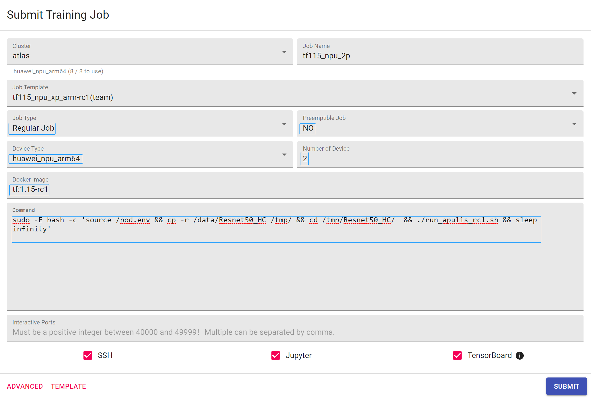

2. 输入Job Name，例如“`tf115_npu_2p`”；
3. 选择Job Type为“`Regular Job`”, 一台atlas服务器上使用多张NPU卡的训练任务；
4. 选择Preemptible Job为“`NO`“，训练任务占用的资源被能被其他训练任务抢占；
5. 选择Device Type为“`huawei_npu_arm64`”；
6. 选择Number of Devices为“2”, 使用2张NPU卡；

   *平台支持灵活调度，只需要在平台上提交Job时配置应使用的卡数*

7. 在Docker Image中输入本地加载的镜像“`tf:1.15-rc1`”；此镜像中已经安装基础工具;

8. 在`Command`中输入如下指令：

    ```bash
    sudo -E bash -c 'source /pod.env && cp -r /data/Resnet50_HC /tmp/ && cd /tmp/Resnet50_HC/  && ./run_apulis.sh && sleep infinity'
    ```
    *以上均在脚本内设置并解析了平台的环境变量,单机情况下，shell脚本会自动生成json文件*

9. 勾选SSH、Jupyter，Tensorboard 等组件后，点击“SUBMIT”

10. 在View and Manage Jobs里打开刚刚创建的Job，等待Job的状态改变为“Running”

    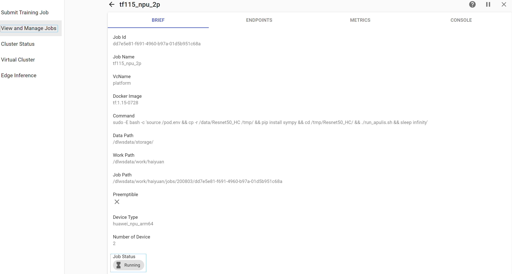

11. 选择`ENDPOINTS`选项卡；

    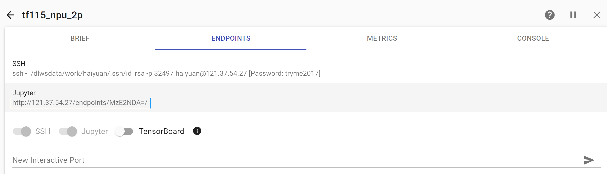

12. 点击Jupyter里的链接，可以打开Jupyter Lab查看和编辑训练代码，一般在`/data/resnet50_050`

    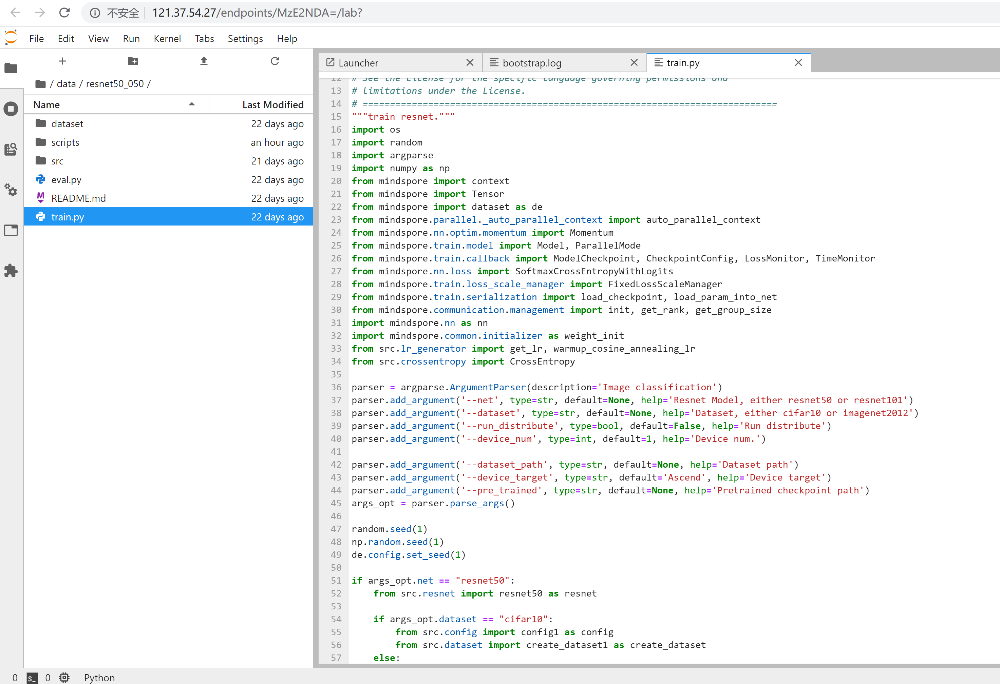

    也可以在 `/home/<username>`目录下查看训练日志

    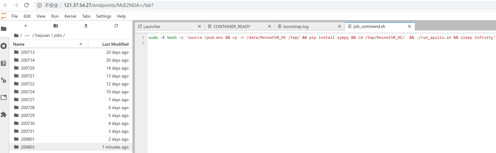

13. 如果启用了TensorBoard，点击TensorBoard里的链接，可以查看这个训练任务的训练结果（如图3）；

    *注意： pod中TensorBoard默认读取的log路径为`~/tensorboard/<JOB-ID>/logs`,模型训练需要将其log指定到该目录下*

    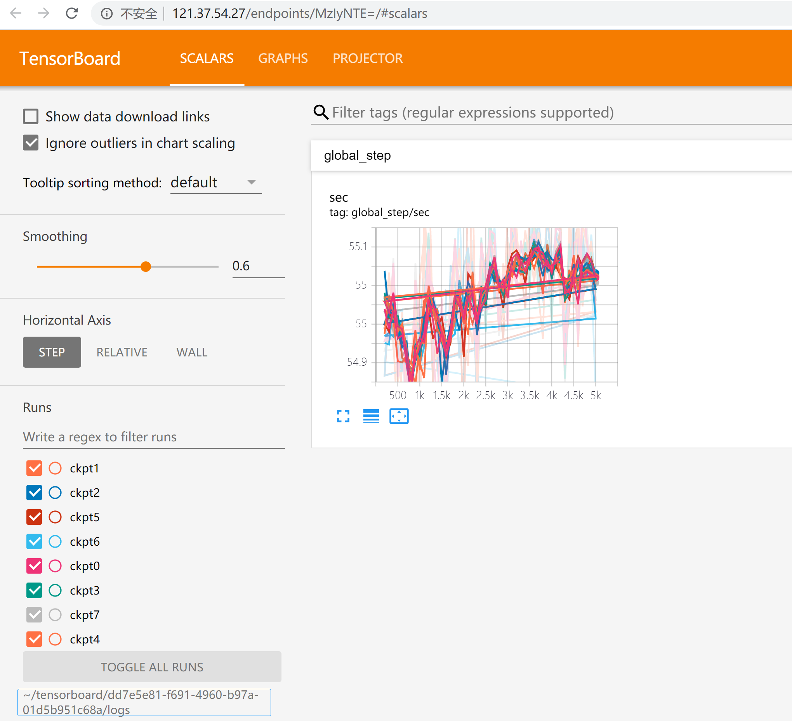

14. 根据SSH中的信息，可以使用SSH Client登录此任务所在的容器，在其中调试；

    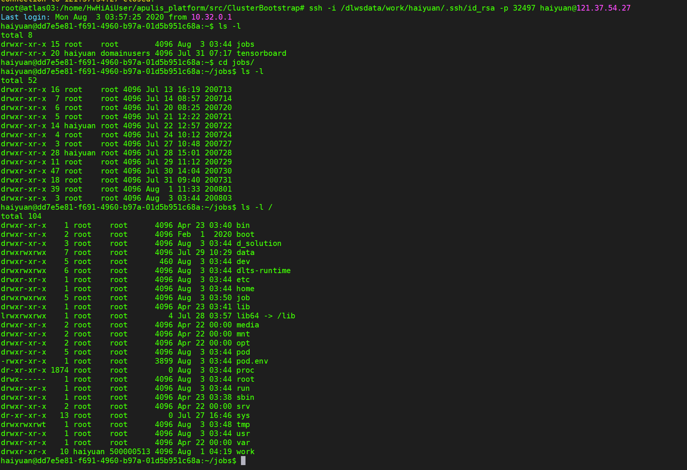

15. 查看 Job 的资源使用率

    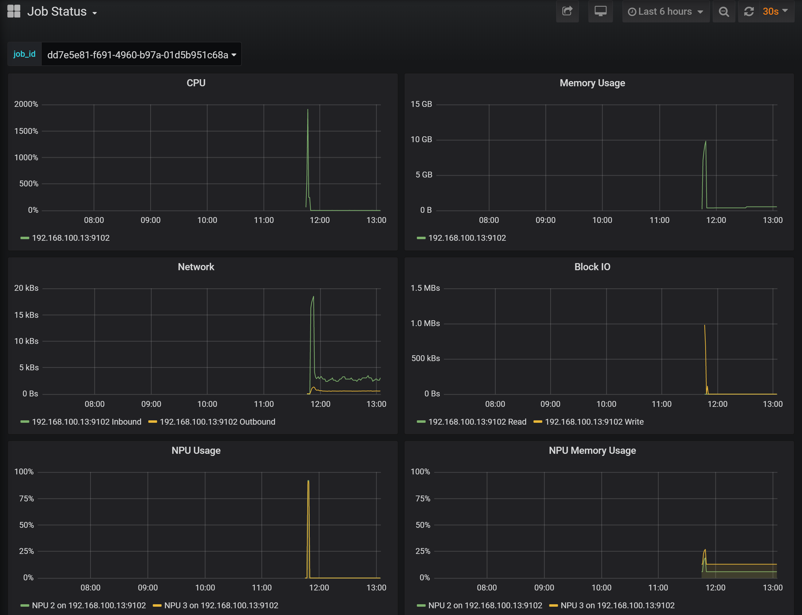

多机任务
---------------------------------------------------------------------------------
*多机多卡和单机多卡训练的流程基本一致。不同之处如下：*

* 选择选择Job Type为“`Distributed Job`”；Number of Nodes大于“0”； 多机多卡并行训练：

* 在`Command`中输入如下指令：

    ```bash
    sudo -E bash -c 'source /pod.env && cp -r /data/Resnet50_HC /tmp/ && cd /tmp/Resnet50_HC/  && ./run_dis_rc1.sh'
    ```

    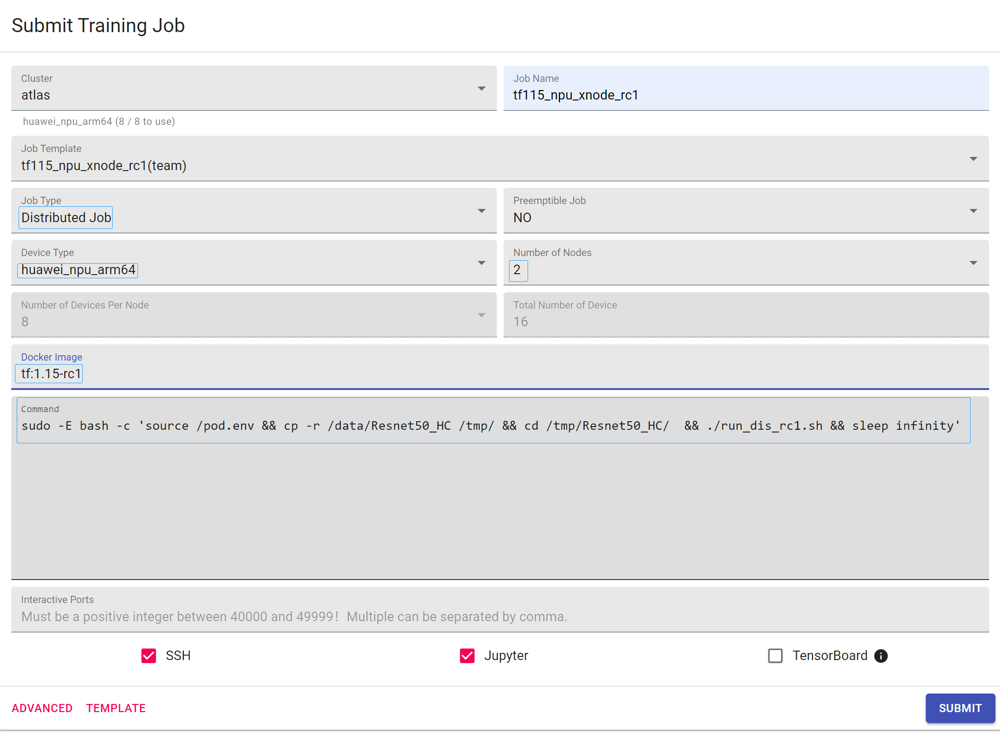
    **多机多卡的情况下，平台会生成多机训练的需要的json文件,只需要在平台上提交Job时配置应使用的卡数。**
         

---

FAQ
---------------------------------------------------------------------------------

1. 如果需将示例迁入新环境
    * 将 NFS 目录下模型及数据集整体拷贝到新环境
    * 需要给执行的脚本添加执行权限`chmod +x run_8p.sh`
    * 进入Resnet50_HC路径下修改相对路径设置

        ```bash
        cd /dlwsdata/storage/Resnet50_HC
        vim run_8p.sh
        ```

    * 将脚本中的json路径设好

        ```bash
        export RANK_TABLE_FILE=/data/Resnet50_HC/hccl_8p.json

        vim ./code/resnet50_train/configs/res50_32bs_8p.py
        # 将数据集路径设好
        'data_url': '/data/Resnet50_HC_data/data/resnet50/imagenet_TF'
        ```

2. 打开Endpoint Jupyter 或 TensorBoard 需要将私网域名转换为平台外网访问IP,如下所示：
   
   * 在 Job 详情中查看 Endpoint 链接

    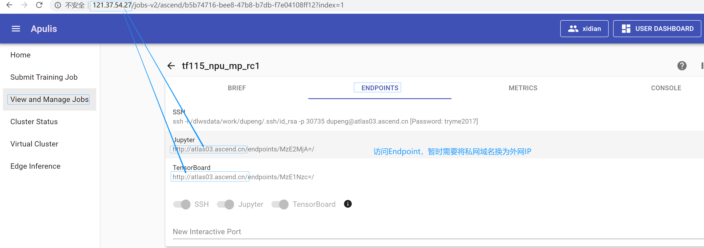
    
   * 使用外网IP链接打开 Tensorboard 

    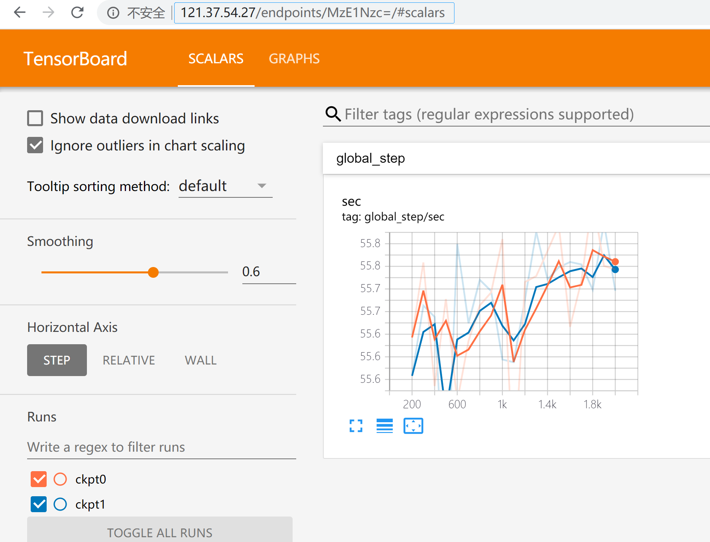
   