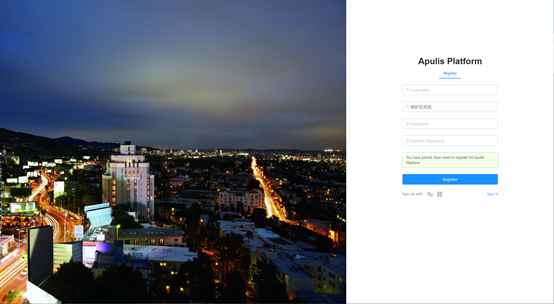

用户在浏览器地址栏输入平台地址，进入登录页面，默认为账号密码登录的页面。如图1所示。【注意】浏览器推荐Chrome。
平台目前支持三种登录方式，账号密码登录、微信登录和微软邮箱登录。

​                                                                                                        图 1 登录页面

## 2.1.1 账号密码注册登录

点击登录页面的Sign up，跳转到注册页面，如图2所示。设置用户名、昵称、密码后即可完成注册，完成注册后跳转到登录页面。使用新注册的账号登录平台后会提示“Sorry,you are no authorized to access this page”，请联系系统管理员获取权限，权限获取后，则可以正常使用平台。
如用户已有账号，在登录页面输入账号和密码后点击login按钮，即可登录平台。

​                                                                                                       图 2 用户注册页面

## 2.1.2 微信注册登录

在登录页面选择“Sign in with微信”后，跳转到微信扫码页面。如果微信未注册，扫码后跳转到微信注册页面，如图3所示，设置用户名、昵称、密码后即可完成注册。新注册的用户需联系管理员获取权限，权限获取后，则可以正常使用平台。如扫码的微信已注册，扫码后即可登录平台。

​                                                                                                           图 3 微信注册

## 2.1.3 微软邮箱注册登录

在登录页面选择“Sign in with微软”后，跳转到微软邮箱登录页面，输入邮箱账号、密码后即可登录。第一次通过邮箱登录的账户，需联系系统管理员获取权限。

​                                                                                                         图 4 微软邮箱登录