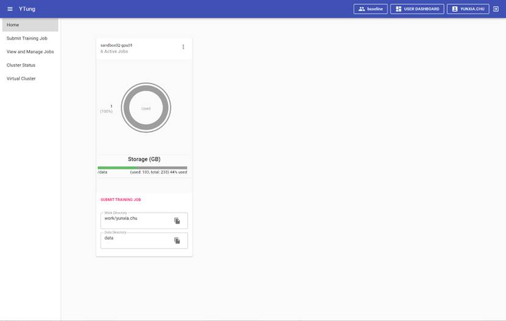
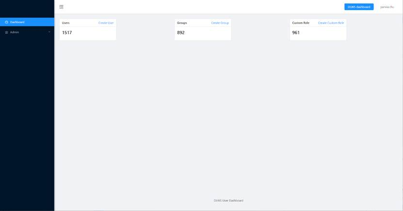
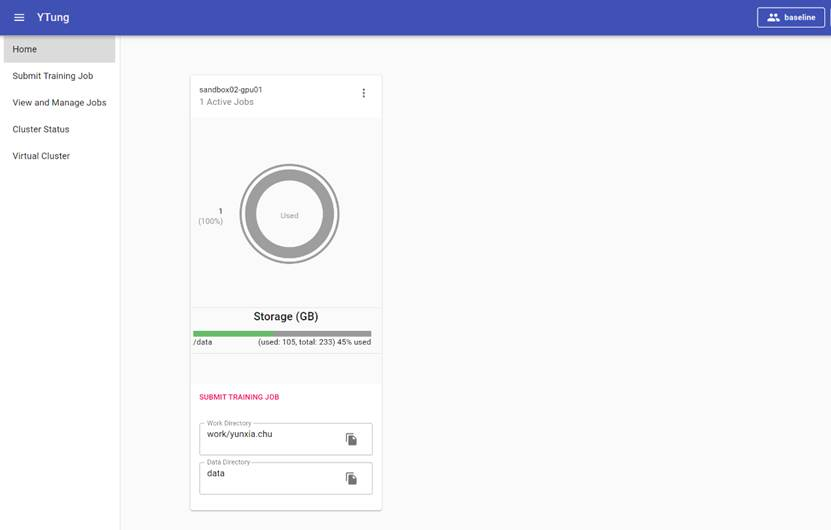
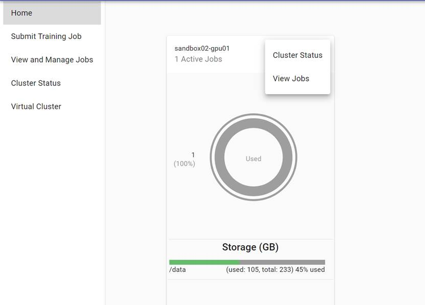
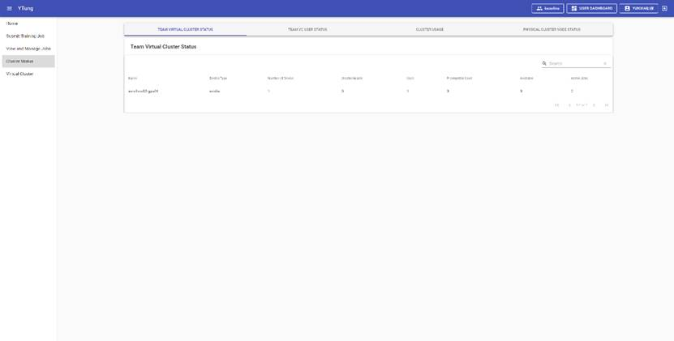
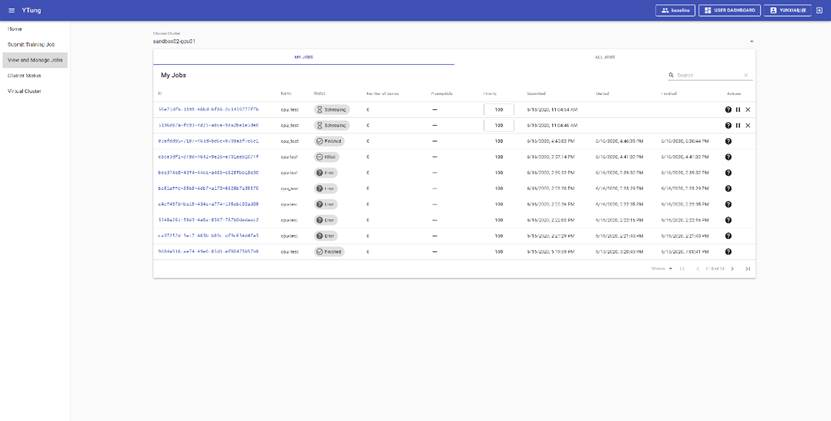

The username, nickname and VC info are displayed on the menu bar at the top of the page, as well as on the user dashboard menu and exit menu.

The menu bar on the left includes five submenus: Home, Submit, Training Job, View and Manage Jobs, Cluster Status, and Virtual Cluster.

The main chart on the home page also displays the system resource usage and quick links. As shown in Figure 6. 

Figure 6:  Home Page

## 2.2.1  Menu Bar

The menu bar at the top of the page is shown in Figure 7, with the  icon for displaying/hiding the left side menu. The "Apulis" icon functions the same way as the "Home" in the menu bar and will lead the page back to home page once it is clicked. The "platform" is the currently selected virtual cluster. User can select other VC by clicking it. The “USER" icon is for user management page, as shown in Figure 8, on the right side of the menu. The icon  is to log out the current user and return to the login page.

Figure 7:  Home Page Upper Menu

Figure 8:  User Dashboard

## 2.2.2  Main Chart

The chart on the home page includes four sections:  number of jobs currently running in VC, resource usage statistics, storage resource statistics in the cluster, and the work paths and data paths, as shown in Figure 9. 

Figure 9:  Home Page Statistics

Other than the paths and statistics, the main chart also includes the quick link for viewing the submitted jobs and cluster status. By clicking the corresponding buttons as shown in Figure 10, the page will jump to the specific page. For example, by clicking the “SUBMIT TRAINING JOB”, user will be brought to the “submit training job” page as shown in Figure 13. By clicking the icon on the right side of the chart, and select “Cluster Status”, user will be bright to the Cluster Status menu as shown in Figure 11 to check the resources status and job running status in VC. By selecting “View Jobs”, the page will jump to My Job page as shown in Figure 12, to view all the jobs under the current user. 

Figure 10:  Quick Link

Figure 11:  Team Virtual Cluster Status

Figure 12:  My Jobs Page