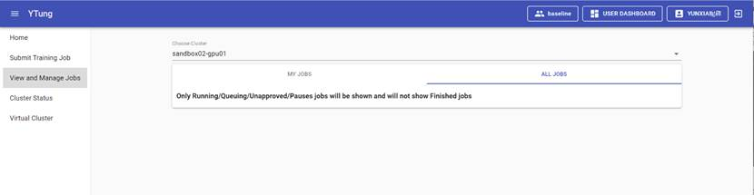
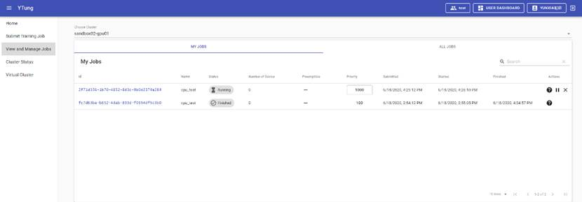
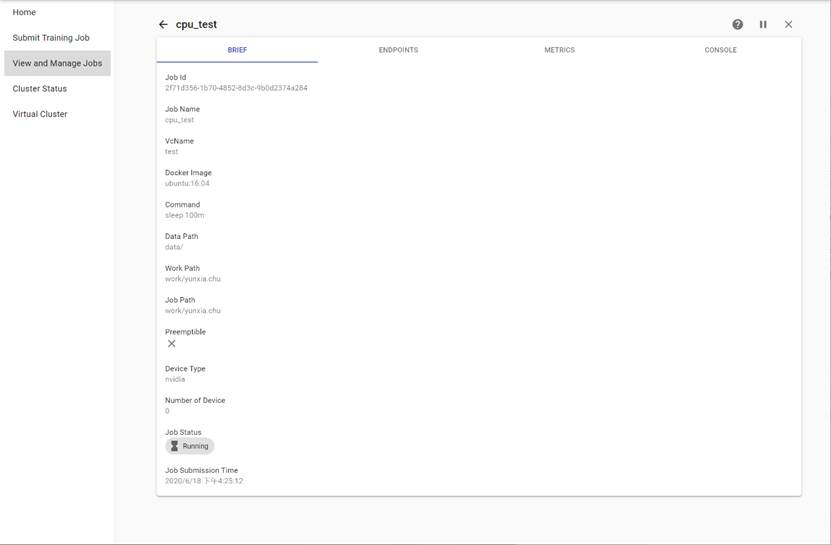
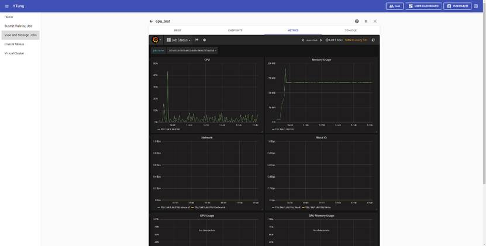
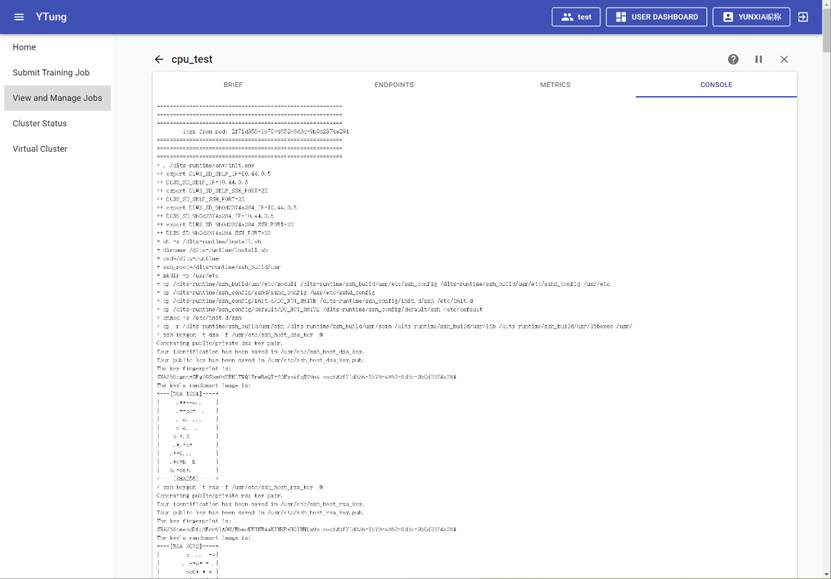

View and Manage Jobs includes two tabs, respectively, MY JOBS and ALL JOBS. M Y JOBS is the job history list of the currently logged-in users, including completed and failed jobs. ALL JOBS tab will be shown if the currently logged-in user is an administrator. It shows the job list of all users, showing only the jobs in queue, scheduled jobs, and suspended jobs. It will not show the completed and failed jobs, as shown in Figure 19. 

Figure 19:  All Jobs

## 2.4.1  Job List

Job list include ID, Name, Status, Number of Device, Preemptible, Priority, Submitted, Started, Finished, and Actions, as shown in Figure 20. 

·     ID: job ID, click to jump to the job detail page.

·     Name: job name. 

·     Status: job running status. The running status includes queued, scheduling, running, pausing, paused, finished, error, and failed.

·     Number of Device: the number of configured devices that the job is executed upon. 

·     Preemptible: if the job can be preempted. 

·     Priority: job priority, default priority is 100, can be set in the range from 1 to 1000.

·     Submitted: the job submission time.

·     Started: the job start time.

·     Finished: the job complete time.

·     Actions: include support, pause and kill buttons. For the completed jobs, there will be no pause and kill button. Click support button will pop up an email messaging page, which the user can fill in to send a support email for help. 

Figure 20:  My Jobs

## 2.4.2  Job Details

Click the Job ID in MY JOBS tab or ALL JOBS tab will jump to the job detail page. The Job detail page contains 4 tabs, including BRIEF, ENDPOINTS, METRICS, CONSOLE, as shown in Figure 21. 

Figure 21:  Job Details -Brief Page

·     BRIEF: job information page which includes job id, job name, VC name, docker image, command, data path, work path, job path, preemptible, device type, number of devices, job status, job submission time.

·     ENDPOINTS: If the SSH, Jupyter, Tensorboard was started, and/or an interactive port was configured, the visiting address will be shown here, as shown in Figure 22. Click Jupyter, Tensorboard, interactive port link will jump to the corresponding page. For the Tensorboard link, the training log needs to be saved in the specified path prompted below before the Tensorboard can function properly. If the SSH, Jupyter and Tensorboard was not enabled when the job was submitted, user can enable them on this page. The user can also enable a new interactive port. Please note that after configuring the interactive port, the corresponding link can only be visited after a corresponding service is enabled in the container that listens on the interactive port. 

Figure 22:  Job Detail – ENDPOINTS Page 

·     METRICS: monitor job resource usage status through Grafana, including CPU, Memory Usage, Network, Block IO, GPU Usage, GPU Memory Usage, NPU Utilization, NPU Memory, as shown in Figure 23. 

Figure 23: Job Details – METRICS Page

·     CONSOLE: log output when job is running, display the most recent 2000 lines of the log, as shown in Figure 24. 

Figure 24:  Job Details – CONSOLE Page