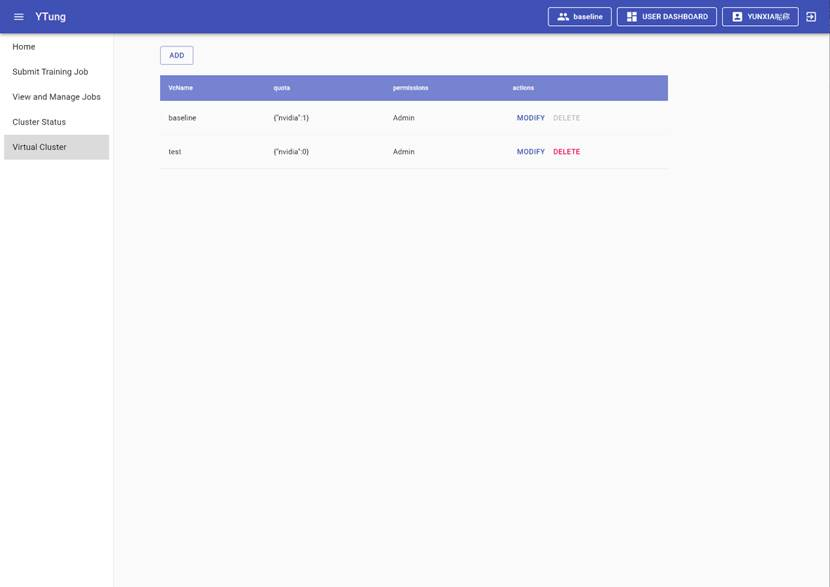
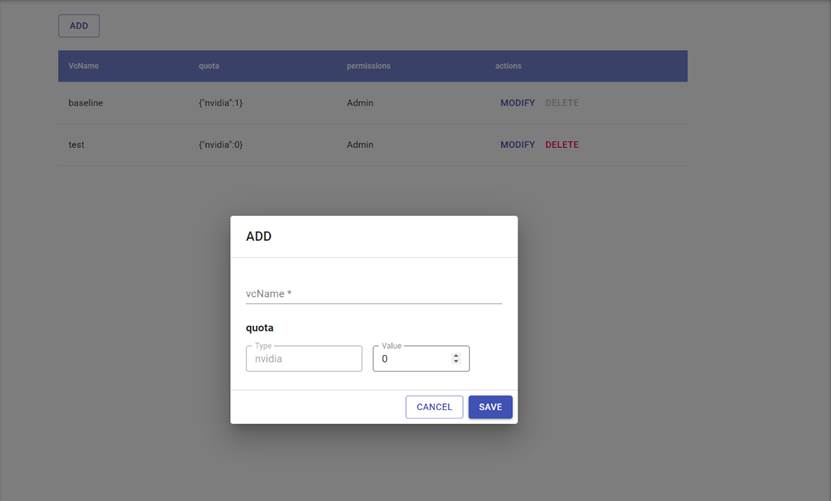
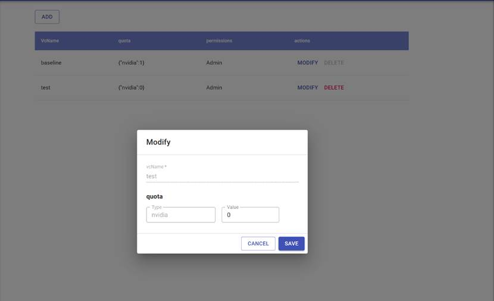
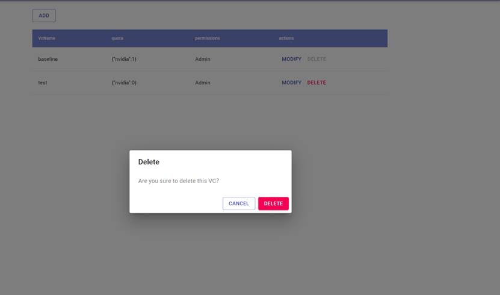

Display the list of configured virtual cluster, as shown in Figure 30. 

Figure 30: Virtual Cluster List

## 2.6.1  VC List 

The list includes VC Name, Quota, Permissions and Action.

·     VC Name: Display VC name.

·     Quota: Displays the computing device type and quantity in each VC.

·     Permissions: access permission of the current logged-in user.

·     Actions: Display the operation column, including modify and delete buttons.

## 2.6.2  Add New VC

Click the ADD button on the top of the list. This opens a new VC page as shown in Figure 31. Enter the VC name, select the VC type, set the value to the number of devices allocated to the VC and then select save, a new VC will be created. New VC name cannot duplicate existing VC names. The value cannot exceed the number of available remaining devices available in the physical cluster.

Figure 31: Add VC

## 2.6.3  Modify VC

Select VC and click the Modify, the Modify window will pop up as shown in Figure 32. Modify VC can only modify the parameter “value”. VC name cannot be modified. Please note that if there are job in the VC currently running, being scheduled, being killed or paused, the “Modify VC” operation cannot be performed.

Figure 32: Modify VC

## 2.6.4  Delete VC 

Select VC and click Delete, the Delete window will pop up as shown in Figure 33. Click Delete and Confirm will delete the VC. Please note that that if there are job in the VC currently running, being scheduled, being killed or paused, the “Delete VC” operation cannot be performed. The operation will delete all information of the jobs in the VC.

Figure 33: Delete VC