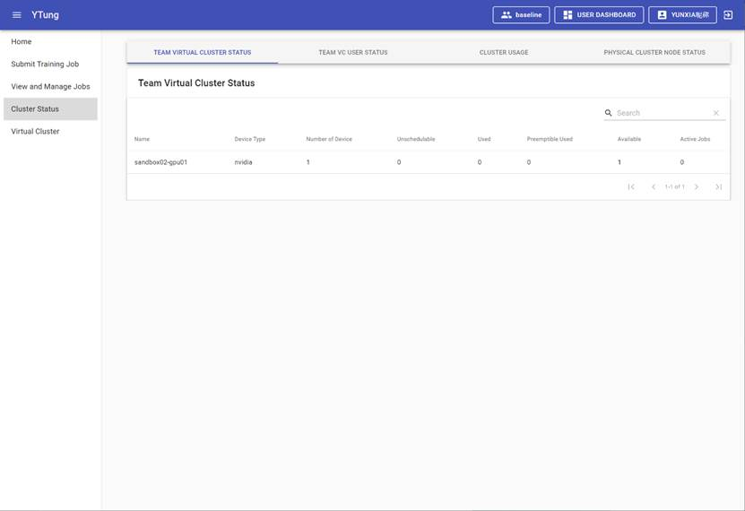
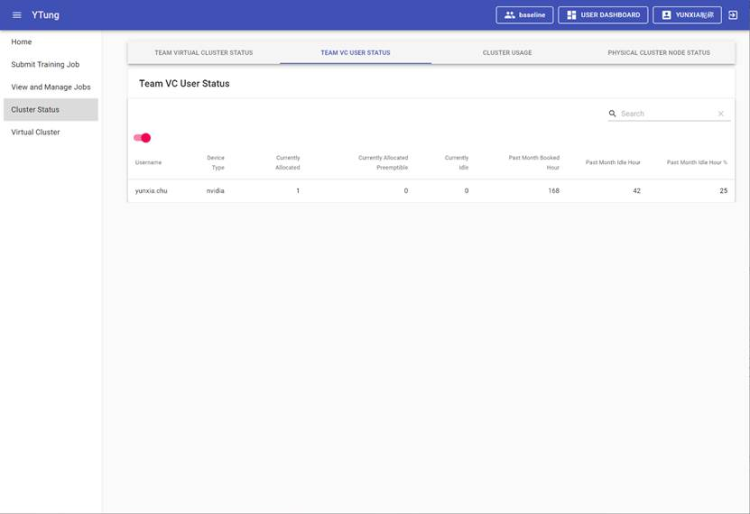
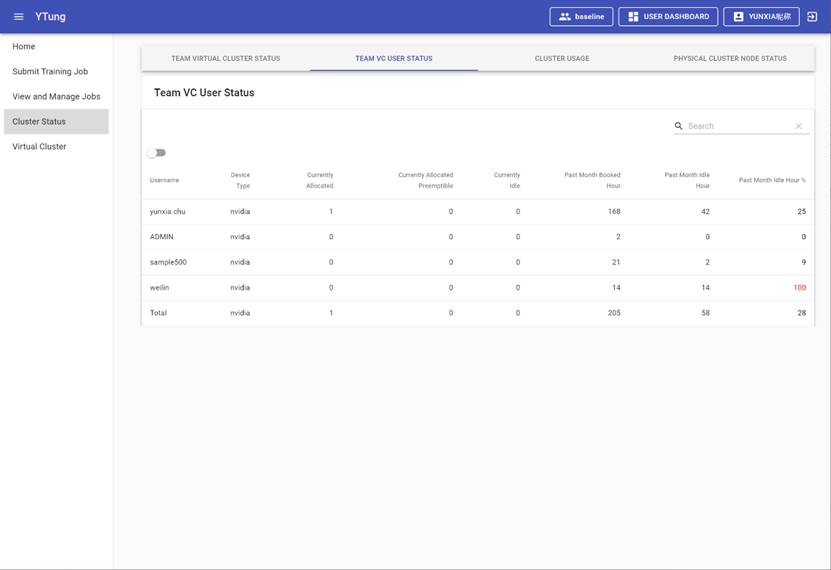
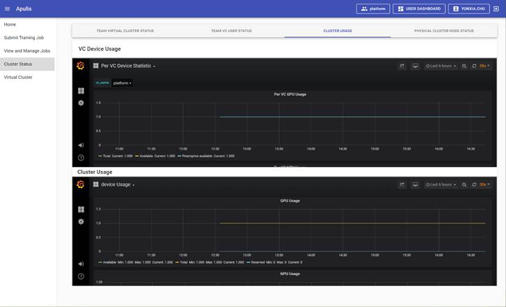
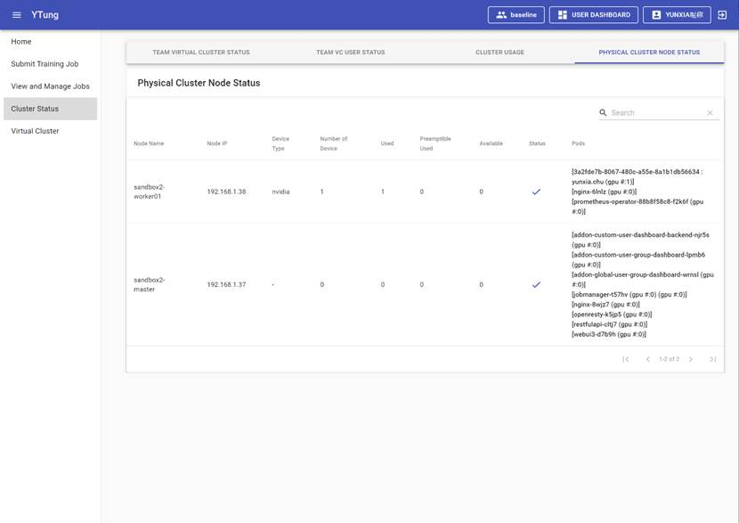

Cluster Status menu include Team Virtual Cluster Status tab, Team VC user status tab, cluster usage tab, and physical cluster node status tab, as shown in Figure 25. 

Figure 25:  Cluster Status

## 2.5.1  Team Virtual Cluster Status

This page shows the virtual cluster status statistic as shown in Figure 24, including: 

·     Name: the name of the physical cluster

·     Device Type: the device type supported in the physical cluster

·     Number of Device: display the total number of devices available in the cluster

·     Unschedulable: display the number of devices that can’t be scheduled (either unhealthy, or marked as unscheduled for resource control purpose)

·     Used: display the number of devices being used

·     Preemptible Used: display the number of devices used that can be preempted 

·     Available: display the usable devices

·     Active Jobs: display the number of running jobs

## 2.5.2  Team VC User Status

The default displays the current VC user list as shown in Figure 26. It can switch to display all user list as shown in Figure 27. The list includes username, Device Type, Current Allocated, Current Allocated Preemptible, Currently Idle, Past Month Booked Hour, Past Month Idle Hour, and Past Month Idle Hour. 

Figure 26: User List of the VC in Use

Figure 27: User List of All VC

·     Username: username.

·     Device Type: device type used. 

·     Current Allocated: the number of devices assigned. 

·     Current Allocated Preemptible: the number of preemptible devices.

·     Currently Idle: the available devices.

·     Past Month Booked Hour: the total device usage in hour in the past one month. 

·     Past Month Idle Hour: the total device idle time in hour in the past one month. The device idle time is defined as the duration in which a job is assigned GPU/NPU device with 0% utilization。 

·     Past Month Idle Hour%: display the percentage of time when device was assigned but with 0% usage in the past one month. 

## 2.5.3  Cluster Usage

This tab includes VC Device Usage and Cluster Usage charts as shown in Figure 28.

Figure 28: Cluster Usage

## 2.5.4  Physical Cluster Node Status

This tab displays the status of physical cluster as shown in Figure 29, including Node Name, Node IP, Device Type, Number of Device, Used, Preemptible Used, Available, Status, and Pods.

Figure 29: Physical Cluster Node Status

·     Node Name: the name of each node in the physical cluster.

·     Node IP: the internal IP address of each node in the physical cluster.

·     Device Type: the computing device type of each node.

·     Number of Device: the number of computing devices of each nod. 

·     Used: the number of computing devices in use in each node. 

·     Preemptible Used: the number of computing devices in use that can be preempted in each node.

·     Available: Displays the number of available devices in each node.

·     Status: display node status.

·     Pods: Displays pods running on the node.