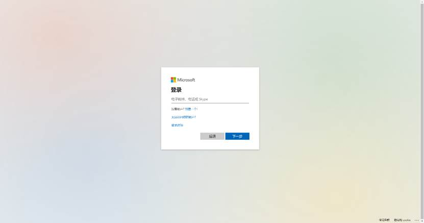

An user can access the login page after entering the platform address in the browser address bar. The default login page is shown in Figure 1. Please note that Chrome is the recommended browser.

The platform currently supports three ways to login:  account username & password, WeChat login, and Microsoft account login.

Figure 1:  Login Page

## 2.1.1  Login with Account Username & Password

The default login method is account username & password. Once the correct account username and password are entered, click the login button to log in to the system, as shown in Figure 2. 

Figure 2:  Username & Password Login

For new account registration, click on the registration button and the page will automatically jump to the registration page as shown in Figure 3. Follow the instruction to set the user name, nickname, and password to complete the registration process. Once it is done, the page will jump back to login page for user to sign in. When the user sign in the first time, the system will show the below message "Sorry, you are not authorized to access this page", please contact your system administrator to grant you the access permission to complete the account setup.

Figure 3:  User Registration

## 2.1.2  Login with WeChat

For WeChat login, the user can use his/her WeChat to scan the barcode to login if the user’s WeChat account has been registered with the system. If the WeChat account is not yet registered, the user can click the sign up button and jump to the WeChat registration page, as shown in Figure 4. The user can then follow the instruction to complete the registration process. Newly registered users need to contact the system administrator for permission to complete the account setup process. 

Figure 4:  WeChat Login

## 1.1.3  Login with Microsoft Account

For Microsoft account login, the user can use his/her Microsoft account to login as shown in Figure 5. The Microsoft account can be either an email ends with @live.com, @outlook.com, @hotmail.com, or a domain linked to Microsoft 365. User need to contact their system administrator for permission before first time using Microsoft account to login. 

Figure 5:  Microsoft Account Login