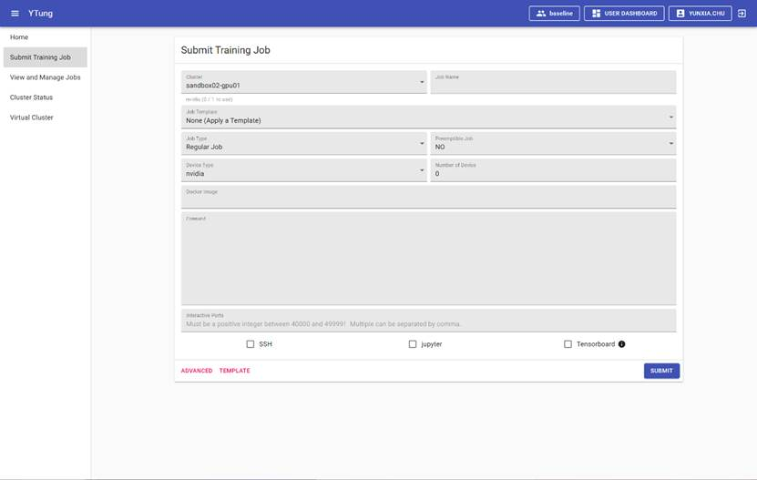
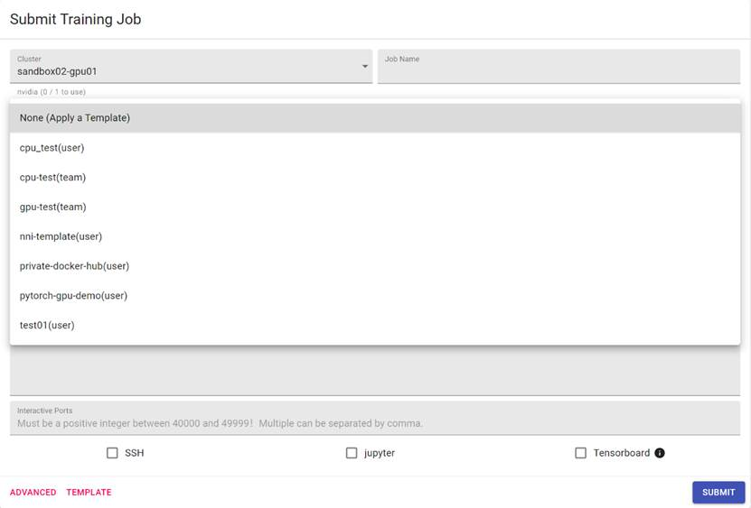
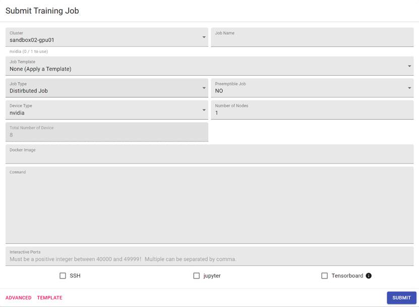
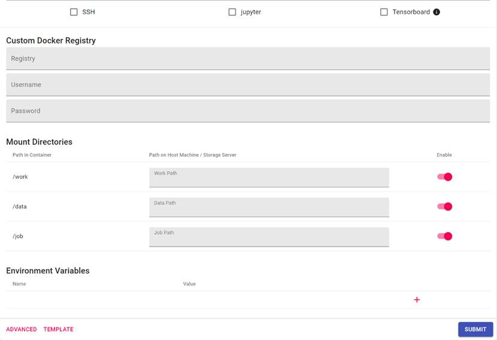
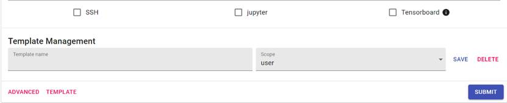
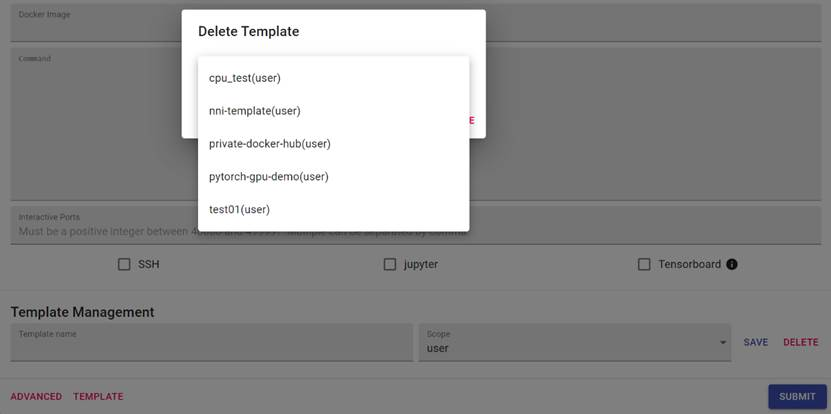

By clicking the ' Submit Training Job" in the menu bar, the user can access the submission job page, as shown in Figure 12. The page includes basic setting, advanced settings, and template settings. After the job is submitted, the page will jump to Job detail page. 

Figure 13:  Submit Training Job

## 2.3.1  Basic Settings

Basic settings include 11 parameters:  Job Name, Job Template, Job Type, Preemptible Job, Device Type, Number of Device, Docker Image, Command, Interactive Ports, endpoints, where the Device Type parameter and the Number of Device parameter are associated with the specific VC in the menu bar above, and can only configure the resources assigned to the VC.

The detail description for each parameter is provided below: 

·     Cluster:  The current physical cluster name to be selected for job. 

·     Job Name:  Required, specify the name of the training task.

·     Job Template:  You can select an existing training task template, as shown in Figure 14.

Figure 14:  Template List

·     Job Type: set the task type, the available choices are the Regular Job and the Distributed Job. If the Distributed Job is selected, the number of devices is changed to the number of nodes, and the parameter Total Number of Devices is also added. The Total Number of Devices equals to the Number of Nodes multiply by 8, as shown in Figure 15. 

Figure 15:  Job Type Set to Distributed Job

·     Preemptible Job: This parameter is to set whether a task can be preempted. The NO setting means the task cannot be preempted, and YES setting indicates that the task can be preempted, and the task resources be reassigned to other tasks.

·     Device Type: Set the computing device type as CPU, NPU or GPU. If the system has multiple GPUs of different type (e.g., Nvidia 2080Ti GPU and Nvidia V100 GPU), it can also specify the particular GPU type to be used for the task.  

·     Number of Device: Set the number of devices that you need for a training job. The number cannot exceed the total number of devices in the current VC.

·     Docker Image (required): the Docker image name of the task. After the job is submitted, the corresponding Docker image will be automatically pulled if necessary. 

·     Command (required): Set the script to start a training job. After the container is started, the command will be automatically executed. You can also set it as “sleep infinity”, which hangs the task. You may then manually connect the container and perform necessary operations. 

·     Interactive Ports (optional): The user can set up an interactive port within the container that can be accessed outside of the cluster. The AI platform will provide access information once the job starts.

·     SSH, Jupyter and Tensorboard Interactive Ports(optional): The user can enable SSH, Jupyter, and Tensorboard access to the job. The container will automatically start the SSH, Jupyter, and Tensorboard services once it is started, and provide the access link. 

## 2.3.2  Advanced Settings

Advanced settings include Custom Docker Registry, Mount Directories and Environment Variables, as shown in Figure 16. 

Figure 16:  Advanced Settings 

·     Custom Docker Registry: can be set to a private docker registry address, user name, password. [Note] If the private docker registry is insecure and/or self-signed private docker registry, the user needs to modify daemon.json file during the installation of the AI platform to use the private docker registry.

·     Mount Directories:  This establishes a mapping between the container storage and a machine path mapping of a shared storage device. The information consists of a triplet of Path in Container (the container path), Path on Host Machine/Storage Server (physical machine path), Enable (Yes or No). Unless there are special needs, the user generally does not need to change this parameter. 

·     Environment Variables:  Additional environment variables to be added automatically after container starts.

## 2.3.3  Template Settings

Template settings include Save Template and Delete Template, as shown in Figure 17. 

Figure 17:  Template Settings

·     Save Template:  After setting each parameter in the basic settings and advanced settings, user can save the setting as a template for future use. When saving the template, you can set the scope as user (individual user) or team (virtual cluster). If the scope is set as “user”, the current logged-in user can select the template after switching VC, and the template will not be visible to other users. If the scope is set as “team”, other users can select the template in the current VC after logging in. 

·     Delete Template:  If there is no template in the current VC, the DELETE button is not displayed; if there is a template in the current VC, click DELETE and the delete template page will pop up. After selecting the template, click DELETE to delete the selected template, as shown in Figure 18. 

Figure 18:  Delete Template