User Dashboard page includes upper menu bar, dashboard and Admin, as shown in Figure 34, where the Admin includes User, Group, and Role. 

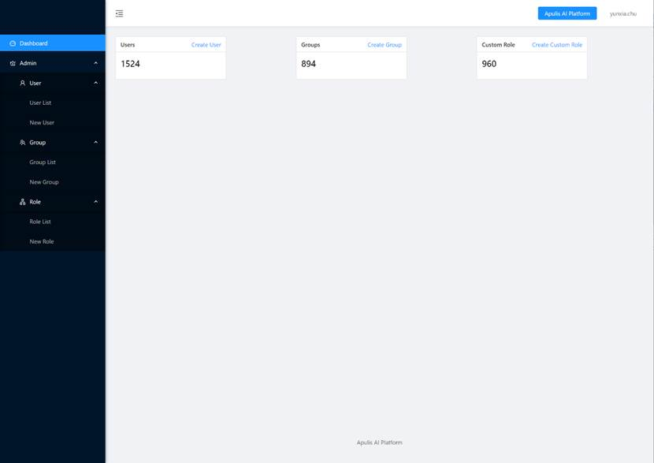

Figure 34: User Dashboard

## 2.7.1  Upper Menu Bar

Upper Menu Bar include Apulis Dashboard button and the user name. Click Apulis Dashboard button to switch to Deep Learning Platform. After clicking the user name, you can choose Account info or logout. Select Account to open user details page as shown in Figure 35. Select Logout to exit the current session and logout, system will also jump to login page. 

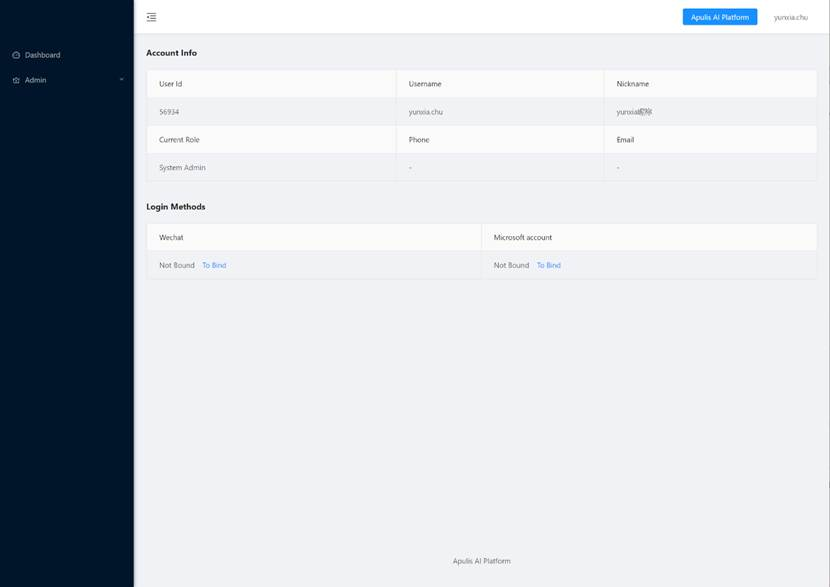

Figure 35: Account Info

  The User Details page contains Account Info and Login Methods. Account Info shows the user’s basic information, such as User ID, Username, Nickname, Current Role, Phone and Email Address. Login Methods shows whether user has associated a WeChat and/or Microsoft account with the user. If not, click To Bind to jump to the biding page. 

## 2.7.2  Dashboard

  The Dashboard shows the number of existing users, user groups and roles. Click create user to quickly jump to the new user interface; click create group to quickly jump to the new group page; click create custom role to quickly jump to the new role page. 

## 2.7.3  User

The User includes user list and new user, user list shows the existing user. Click on the New User button to create new user. 

### 2.7.3.1  User List

The user list includes username, nickname, phone, email, and action, as shown in Figure 36. 

Figure 36: User List

·     Username: a unique user name in the system that cannot be duplicated. 

·     Nickname: the nick name of the user.

·     Phone: the phone number of the user. 

·     Email: the email address of the user. 

·     Action: the operation column, including editing roles, associating the current user to a user group, and deleting user. Only if the current user is a system administrator that he/she can associate other users to a user group, edit role and delete user. After clicking Edit Role, the role modification page pops up and the current logged in user can modify the association relationship of the user if permitted. After clicking Associate to User Group, the associated user group page pops up for modifying the association relationship between the user and the user group. After clicking Delete, a confirmation prompt pops up to confirm and then to delete the user. 

Click on the nick name on the list can jump to the user details page, as shown in Figure 37. It shows the user information, User Roles and User Groups. The modifiable user information includes nickname, phone number, email and description. A system administrator may reset a user’s password. The User Role area shows a list of roles that the current user has associated with. The user may click Remove to remove a particular association. The associated user group displays the list of user groups associated with the current user. The user may click Remove to remove the association. 

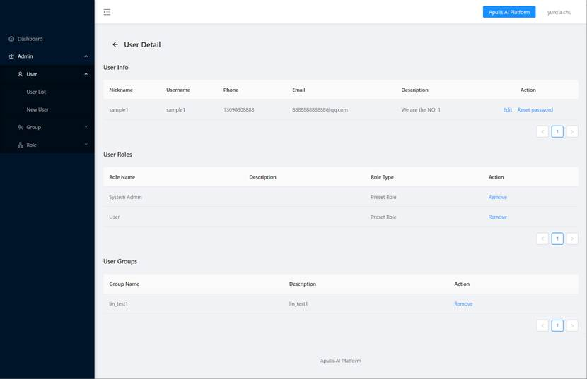

Figure 37: User Detail Page

### 2.7.3.2  New User

Three steps are required to create a new user:  fill up user information, associate roles, and preview, as shown in Figure 38 to Figure 40. 

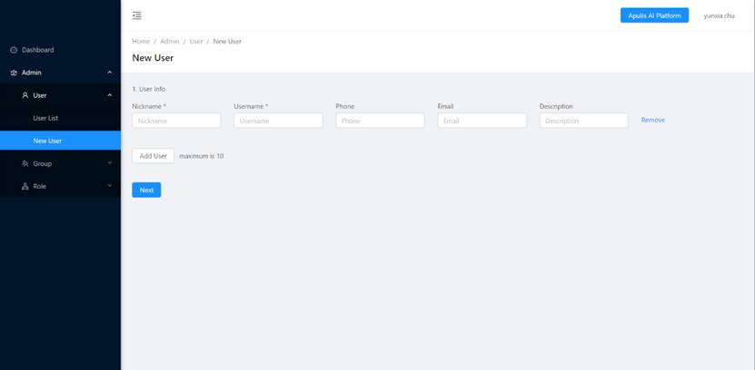

Figure 38: Create New User – User Information

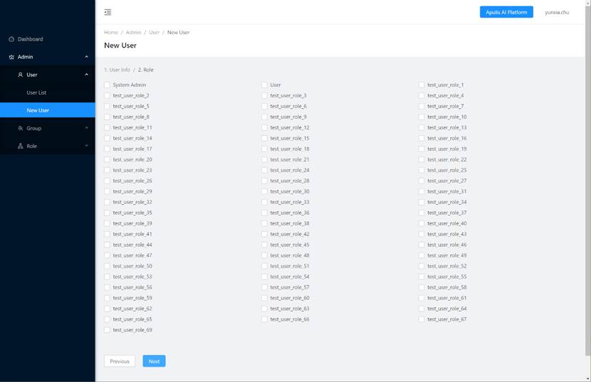

Figure 39: Create New User – Role Association

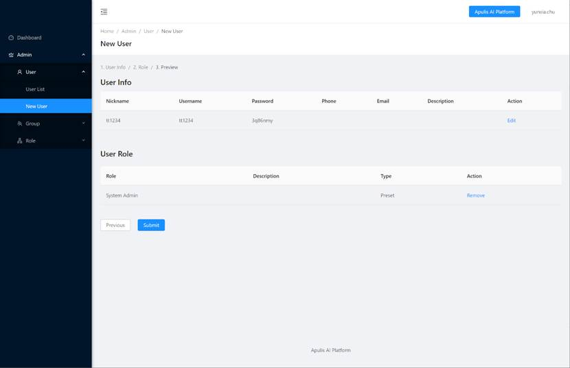

Figure 40: Create New User – Preview

·     User information: username and nick name are the required fields. Once complete, click on the Next button and jump to the association page. Multiple users (up to 10) can be added in a batch.

·     Associated Roles: At least one associated role has to be selected. Click on the next to jump to Preview page, user can also click on Previous button to return to the previous page. 

·     Preview: display the newly created user information and the associated role list. The user information can be modified with nickname, user name, password, etc., and the associated role can be removed from the user role. Click submit to create a new user, click Previous button to return to the previous step.

## 2.7.4  Group

  The Group includes group list and new group. Group list shows the list of existing groups. Click on the New Group to create a new user group. 

### 2.7.4.1  User Group List

User Group List includes group name, description, create time, and action as shown in Figure 41. 

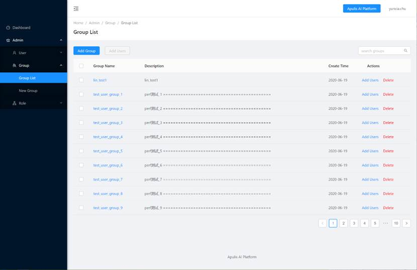

Figure 41: List of User Group

·     Group Name: a unique group name in the system. 

·     Description: the description text of the group. 

·     Create Time: the creation time of the group

·     Actions: display the operation column, including Add and Delete group. The adding page will pop up after clicking on the Add Users button, and additional users can be added to the group. After clicking the Delete button and Confirm, a group can be deleted. 

Click on the name of the user group in the list to display the user group information, its associated roles and users, as shown in Figure 42. User group information can be edited to modify the name and description of the group. The list of roles associated with the current user group is displayed in the associated roles. A specific associated role can be removed after clicking Remove button in the Role list. The associated user table displays the users associated with the current user group. The Remove button may remove a particular user from the user group. 

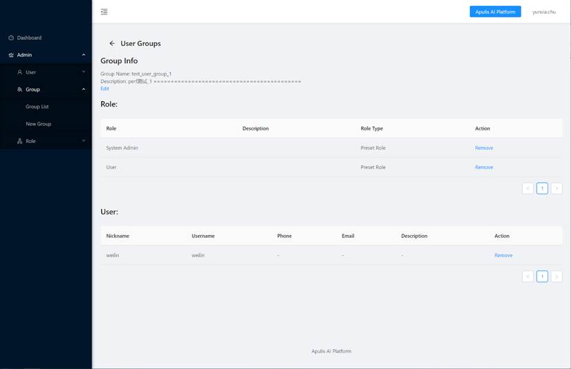

Figure 42: User Group Information

### 2.7.4.2  New Group

Three steps are required to create a new group:  fill up group information, associate the roles and preview, as shown in Figure 43 to Figure 45. 

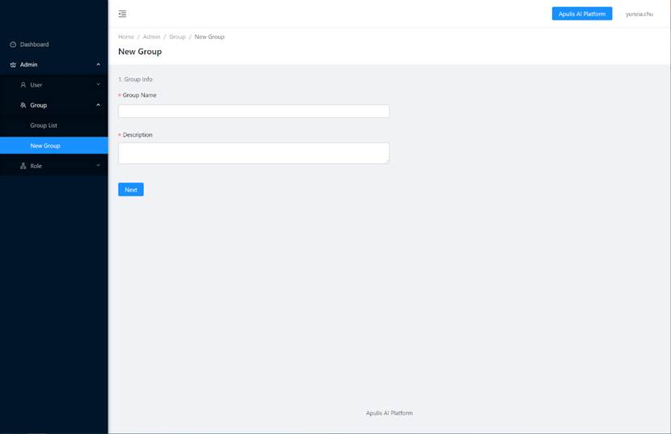

Figure 43: Create New User Group – Group Information

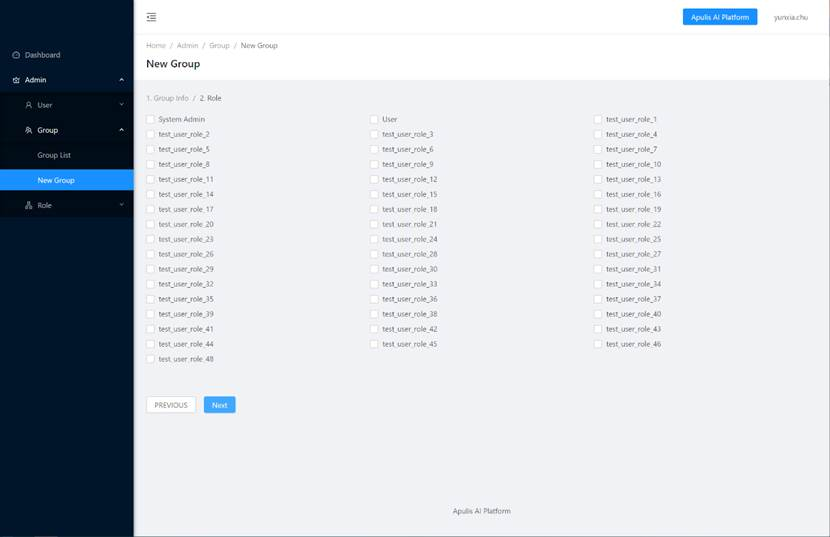

Figure 44: Create New User Group – Role Association

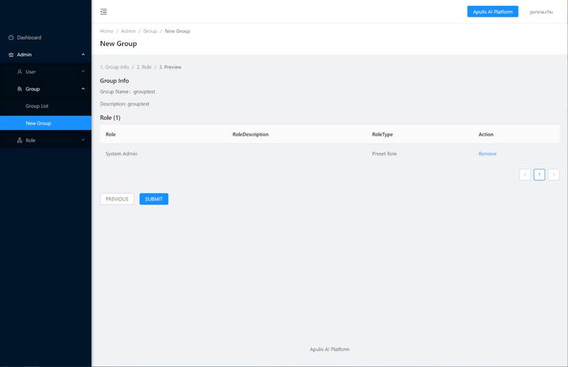

Figure 45: Create New User Group – Preview

·     User Group Information:  Group name and description are required field, after filled, click Next button to move to the Associated Role page. 

·     Associated Role: Selected at least one associated role, click on Next to jump to Preview page. User can also click on Previous to return to the previous page. 

·     Preview: Preview the group information and associated role list for the to be created group. The associated roles can be removed from the user group at the stage.  Click Submit button to create a new user group, and click Previous button to return to the previous step.

## 2.7.5  Role

The Role include Role List and New Role. The Role List shows a list of the existing roles. Click New Role to create new roles. 

### 2.7.5.1  Role List

Role list include role name, description, type, and action, as shown in Figure 46. 

Figure 46: Role List

·     Role Name: a unique name of the role that cannot be duplicated in the system.

·     Description: a text description of the role. 

·     Type: the role type, the choices are Preset Role and Custom Role.

·     Actions: The possible operations are Related Users to a role, Related User Groups to a role and Delete the role. Click the “Related To User” button to pop up the user association page, you can select the user to associate with the role. Click the “Related To Group” button to pop up the user group association page, you can select the user groups to associate with the role. Click Delete, a confirmation message pops up, and after confirmation, the role is deleted. Please note that the two preset roles (System Admin and User) of the platform cannot be deleted.

### 2.7.5.2  New Role

The New Role page creates a new role. It is required to fill in the role name, and role description. The new role can be created after selecting the proper permission assigned to the role as shown in Figure 47. 

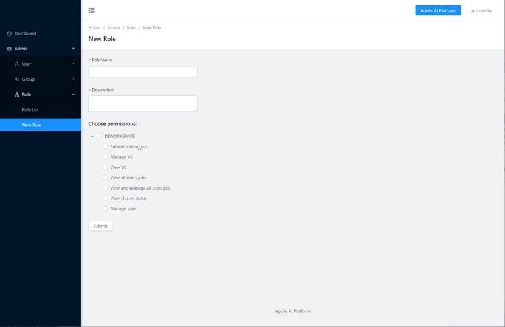

Figure 47: Create New Role

There are 7 types of pre-configured permissions: 

·     Submit training job: the role is allowed to submit a new training job.

·     Manage VC: the role can manage VC, include add, modify and delete VC

·     View VC: the role can view the statistic and monitoring information of the current VC.

·     View all users’ jobs: the role can view all jobs of all users but may not be able to perform any operation on the jobs of the other user. 

·     View and manage all users job: the role can view and manage all the jobs, including pause and kill the jobs. 

·     View cluster status: the role can view the cluster status

·     Manager: the role can manage user permissions. 