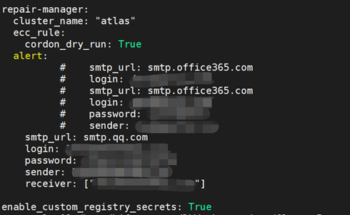
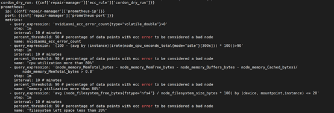
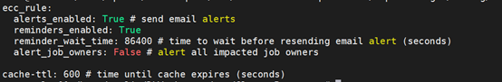
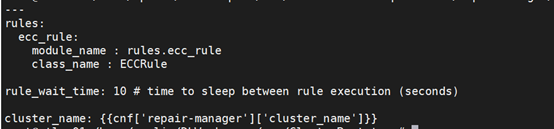

平台暂无可视化的报警配置页面（后续会增加），可通过修改配置文件后重新部署repairmanager2服务，来使相关报警配置参数生效。修改报警参数后，需执行的命令如下：

重新编译repairmanager2服务，如有x86架构的机器，需在x86机器上添加参数--arch amd64执行，如有arm架构的机器，需在arm机器上添加参数--arm arm64执行：

重新编译：

\#sudo ./deploy.py --verbose --arch amd64 docker push repairmanager2

重启repairmanager2服务：

\#sudo ./deploy.py kubernetes stop repairmanager2

\#sudo ./deploy.py kubernetes start repairmanager2

报警参数相关的配置文件共4个，分别为：

apulis_platform/src/ClusterBootstrap/config.yaml，配置发件人和收件人的信息、报警标题中的集群名称；

apulis_platform/src/RepairManager/config/ecc-config.yaml，配置监控指标的阈值表达式、查询间隔、查询时间段、阈值百分比；

apulis_platform/src/RepairManager/config/rule-alerts.yaml，配置是否启用报警、是否重复报警和重复报警的时间间隔；

apulis_platform/src/RepairManager/config/rule-config.yaml，配置查询的时间间隔。

目前监测的报警指标共4个，分别为nvidiasmi_ecc_error_count、cpu utilization、memory utilization和filesystem left space。

## 2.8.1 config.yaml

cluster_name：配置报警邮件标题中的集群名称。

smtp_url：配置smtp服务器地址。

login和sender：配置发件人的邮箱。

password：配置发件人邮箱的密码。

receiver：配置收件人邮箱，可配置多个。

​                                                                                                图 48 config.yaml配置

## 2.8.2 ecc-config.yaml

query_expression：配置监控指标的阈值表达式，当监控指标的值达到该条件时记录一次报警；

step：配置查询间隔，单位为分钟，假设该值设置为N，则表示每隔N分钟去查询一次监控指标的值；

interval：配置查询的时间段，单位为分钟，假设该值设置为M，则表示在过去的M分钟内，每隔N分钟去查询一次监控指标；

percent_threshold：配置阈值百分比，在监控时间内，报警次数占比大于该值即触发报警，发送报警邮件；

name：配置报警时的邮件标题。

综合各参数的设置，在过去的interval时间段内，每隔step分钟去查询一次，即查询总次数为interval/step（向下取整），设为P；在监控的总次数内，监测值达到阈值表达式时的次数为Q，则报警占比为Q/P；如Q/P*100大于阈值百分比percent_threshold，则触发报警，如Q/P*100小于阈值百分比percent_threshold，则不触发报警。

​                                                                                                    图 49 ecc-config.yaml

## 2.8.3 rule-alerts.yaml

alerts_enabled：配置是否发送邮件，设置为True，则发送报警邮件，设置为False，则不发送报警邮件；

reminders_enabled：配置是否重复发送报警邮件，设置为True，则会重复发送报警邮件，设置为False，则只有第一次报警时才发送报警邮件；

reminder_wait_time：配置重新发送报警邮件的时间间隔，如reminders_enabled设置为True，两次报警时间间隔大于reminder_wait_time则会再次发送报警邮件，如时间间隔小于reminder_wait_time则不会重复发送报警邮件。

​                                                                                                   图 50 rule-alerts.yaml

## 2.8.4 rule config.yaml

rule_wait_time：设置查询间隔，单位为秒，该参数设置为N，即与上次查询各指标的时间间隔为N秒。

​                                                                                                    图51 rule-config.yaml