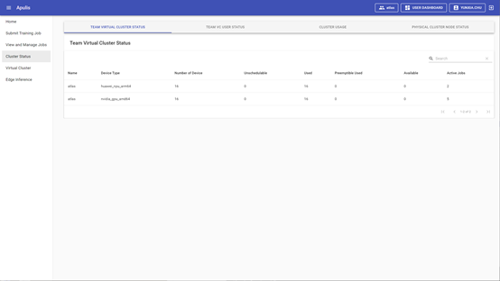
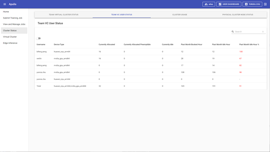
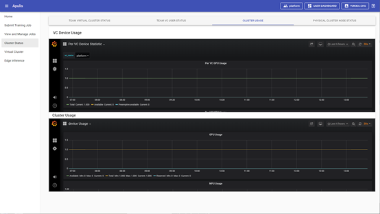

Cluster Status菜单包括Team Virtual Cluster Status、Team VC User Status、Cluter Usage、Physical Cluster Node Status共4个页签，见附图25。

​                                                                                                       图 25 Cluster Status

## 2.5.1 Team Virtual Cluster Status

该页签显示虚拟集群的状态统计列表，见上方附图25，内容包括：

Name：显示物理集群的名称；

Device Type：显示AI计算芯片类型；

Number of Device：显示全部AI计算芯片的数量；

Unschedulable：显示不可调度AI计算芯片的数量；

Used：显示使用中的AI计算芯片的数量；

Preemptible Used：显示使用中的可被抢占的AI计算芯片的数量；

Available：显示可用的AI计算芯片的数量；

Active Jobs：显示运行中的job数量。

## 2.5.2 Team VC User Status

默认展示使用当前VC资源的用户列表，见附图26；可切换显示全部用户列表，见附图27；列表内容包括Username、Device Type，Current Allocated、Current Allocated Preemptible、Currently Idle、Past Month Booked Hour、Past Month Idle Hour、Past Month Idle Hour共八项。

​                                                                                 图 26 当前使用GPU/NPU资源的用户列表

​                                                                                     图 27  所有使用VC资源的用户列表

Username：显示用户名。

Device Type：显示AI计算芯片的类型。

Current Allocated：显示当前AI计算芯片的分配数量。

Current Allocated Preemptible：显示当前分配的可被抢占的AI计算芯片的数量。

Currently Idle：显示当前AI计算芯片的的空闲数量。

Past Month Booked Hour：显示过去一个月，AI计算芯片被占用的小时数。

Past Month Idle Hour：显示过去一个月，AI计算芯片被占用但利用率为0的小时数。

Past Month Idle Hour%：显示过去一个月，AI计算芯片被占用但利用率为0的时间占比。

## 2.5.3 Cluster Usage

包括VC Device Usage和Cluster Usage两个监控页面，见图28。

​                                                                                                         图 28 cluster usage

## 2.5.4 Physical Cluster Node Status

显示物理集群的节点状态，见附图29；包括Node Name、Node IP、Device Type、Number of Device、Used、Preemptible Used、Available、Staus、Pods共9项。

​                                                                                  图 29 physical cluster node status

Node Name：显示物理集群中的各节点名称。

Node IP：显示物理集群中各节点的IP地址。

Device Type：显示各节点的AI计算芯片类型。

Number of Device：显示各节点的AI计算芯片数量。

Used：显示各节点中正在使用的AI计算芯片数量。

Preemptible Used：显示各节点中正在使用的可被抢占的AI计算芯片数量。

Available：显示各节点中可用的AI计算芯片数量。

Staus：显示节点状态。

Pods：显示节点上运行的pods。