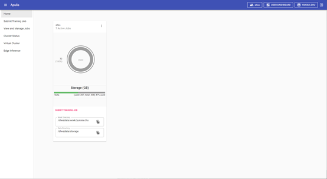
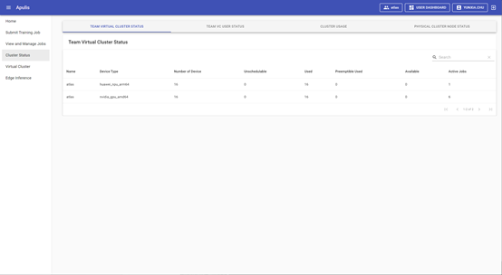

页面顶端菜单栏，展示当前用户所在VC资源组、用户昵称、USER DASHBOARD和退出。

左侧菜单栏包括6个菜单，分别为Home（主页）、Submit Training Job（提交训练job页面）、View and Manage Jobs(查看和管理job页面)、Cluster Status(查看物理集群相关信息页面)、Virtual Cluster(查看虚拟集群相关信息页面)、Edge Inference（中心侧推理）。

主页图表中有资源统计和快捷跳转链接，见图5。

​                                                                                                            图 5 HOME主页

## 2.2.1 菜单栏

页面顶端的菜单栏如图6所示，最左侧图标的功能为显示、隐藏左侧菜单栏；点击“Apulis”可以跳转到平台主页界面；“platform”为当前所选择的虚拟集群VC的名称，点击可进行切换其他VC；点击菜单“USER DASHBOARD”可跳转到用户管理页面，为退出按钮，点击后则退出平台。

​                                                                                                    图 6 平台主页上方菜单栏

## 2.2.2 主页图表

主页的图表包括四部分内容，分别为当前VC中正在运行的job数量统计、资源使用情况统计、集群中的存储资源统计、展示工作路径和数据路径，便于用户了解VC资源的使用情况和物理集群的存储情况，见图7。

​                                                                                                      图 7 首页图表统计

除统计和路径展示外，也提供了提交job、查看job和查看集群状态的跳转链接。点击图7中的“SUBMIT TRAINING JOB”，即跳转到submit training job页面。点击图表右侧的后，如图8所示，选择“Cluster Status”，即跳转到Cluster Status菜单的TEAM VIRTUAL CLUSTER STATUS页签，如图9所示，可查看虚拟集群中的资源和job运行情况；选择“View Jobs”，即跳转到“View and Manage Jobs”菜单的MY JOBS页签，如图10所示，可查看当前登录账户下的所有job列表。

​                                                                                                     图 8 快捷跳转链接

​                                                                           图 9 TEAM VIRTUAL CLUSTER STATUS页签

​                                                                                                  图 10 MY JOBS页签