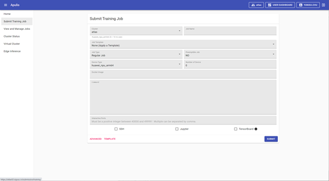
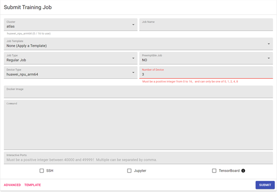
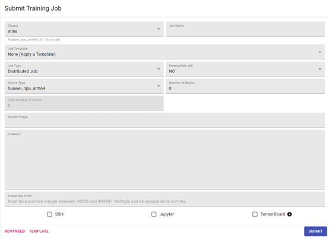
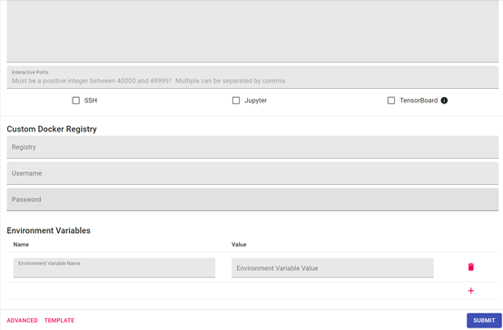

点击菜单栏的“Submit Training Job”，可以进入提交job页面，如图11所示；提交job页面包括基本设置，高级设置和模板设置，提交job后会跳转到job详情页面。

​                                                                                                    图 11 提交job页面

## 2.3.1 基本设置

基本设置包括Cluster、Job Name、Job Template、Job Type、Preemptible Job、Device Tpye、Number of Device、Docker Image、Command、Interactive Ports、endpoints共11项。其中Device Type参数、Number of Device参数，只能选择所在VC资源组中的AI计算芯片和数量。
Cluster：物理集群名称，目前只支持1个物理集群。
Job Name：必填项，表示训练任务名称。 
Job Template：可选择已有的训练任务模板，如图12。

​                                                                                                  图 12 Template列表

Job Type：可设置任务类型，分为Regular Job和Distributed Job；Regular Job，表示进行常规训练任务，Distributed Job，表示进行分布式训练任务。
Preemptible Job：该参数用来设置任务是否可被抢占资源；设置为NO，则表示不可被抢占；设置为YES，则表示可被抢占。设置为NO的Job可以抢占设置为YES的Job,设置为YES的Job不可以抢占任何的Job。
Device Type：资源类型，支持华为huawei_npu_arm64和英伟达nvidia_gup_amd64。
Number of Device：当Job Type为Regular Job时，才显示这个参数项，表示任务训练时需要的AI计算芯片数量，但是不可以超过当前VC中的所有AI计算芯片的总数量。如果Device Type为华为huawei_npu_arm64，那么Number of Device只能填入0、1、2、4、8，这是厂家目前的要求，如图13。

​                                                                                          图13 Number of device的输入限制

Number of Nodes：当Job Type为Distributed Job，才显示这个参数项，表示任务训练时需要物理节点的数量，如图14。

​                                                                                              图 14 Number of Nodes

Total Number of Device：当Job Type为Distributed Job，才显示这个参数项，该参数与Number of Nodes联动。目前缺省认为一个物理节点上AI计算芯片的数量为8个，即Number of Nodes为1时，Total Number of Device为8；Number of Nodes为2时，Total Number of Device为16，如图15。

​                                                                                         图15 Total Number of Device

Docker Image：必填项，填写镜像名称，提交训练任务后会自动下载该镜像。 
Command：必填项，可以填写启动训练任务的脚本等，容器启动后会自动执行训练任务；也可以只填写sleep infinity，job running后用户进入容器内手动执行训练任务。
Interactive Ports：非必填项，可设置容器内的交互端口，容器启动后会提供访问链接。【注意】端口设置范围为40000-49999，如设置多端口时，需用英文的逗号分割。
Endpoints：非必选项，可设置开启SSH、Jupyter、Tensorboard，容器启动后会自动开启SSH、Jupyter、Tensorboard服务，提供访问链接。

## 2.3.2 高级配置

高级配置中包括Custom Docker Registry和Environment Variables，见图16。

​		                                                                                                 图16 提交Job页面-高级配置

Custom Docker Registry：可设置私有docker仓库的地址、用户名、密码；【注意】如私有仓库为http，需修改物理机的/etc/docker/daemon.json文件后重启docker服务。

Environment Variables：新增环境变量值，容器启动后可以获取和使用。

## 2.3.3 模板设置

模板设置中包括保存模板和删除模板，见图17。

​                                                                                         图 17 提交job页面-模板设置

保存模板：基本配置和高级配置中的各参数进行设置后，可设置Template name保存为模板，方便以后使用。模板保存时可设置scope，如果scope设置为user，则当前登录用户切换VC后都可选择该模板，其他用户则不显示该模板；如果scope设置为team，则其他用户登录后，在当前VC中都可选择该模板，切换VC后将不显示该模板。
删除模板：如果当前VC中无模板，则不显示DELETE按钮；如当前VC中有模板，点击DELETE后弹出删除模板页面，选择模板后点击DELETE即可删除，见图18。

​                                                                                                         图 18 删除模板