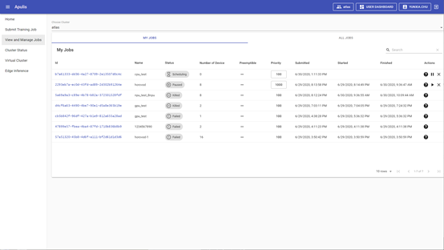
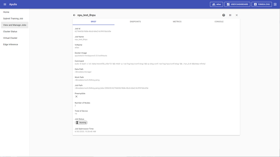
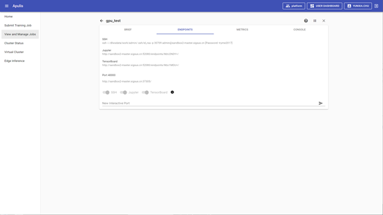
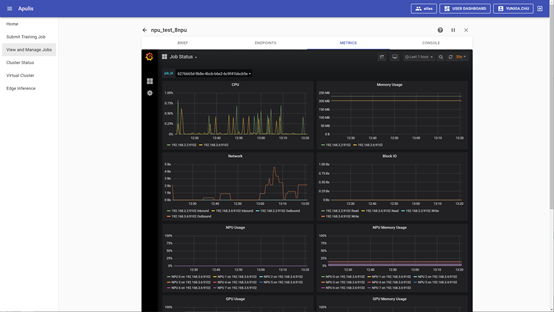
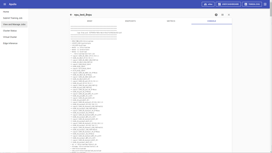

View and Manage Jobs包括两个页签，分别为MY JOBS和ALL JOBS。MY JOBS为当前登录用户的所有job状态的历史列表；ALL JOBS为所有用户的job列表，只展示排队中、调度中和暂停状态的job信息，不展示运行失败和结束的job信息，见图19。

​                                                                                                      图 19 ALL JOBS

## 2.4.1 Job 列表

Job列表中包括十项内容：Id，Name，Status，Number of Device、Preemptible、Priority、Submitted、Started、Finished、Actions，见图20。

Id：表示job Id，点击后可跳转到job详情页面。

Name：表示job名称。

Status：表示job的运行状态，运行状态有queued、scheduling、running、pasuing、paused、finished、error、failed等。

Number of Device：表示job使用的AI计算芯片的数量。

Preemptible：表示该job的资源是否可被抢占。

Priority：优先级，默认为100，可设置的范围为1-1000。

Submitted：显示job的提交时间。

Started：显示job的运行开始时间。

Finished：显示job的运行结束时间。

Actions：可以对job进行support、pause、resume和kill操作，点击support按钮时弹出邮件发送页面，可向运维人员发送邮件寻求帮助。

​                                                                                                         图 20 MY JOBS

## 2.4.2 job详情

在MY JOBS页面或者ALL JOBS页面点击job Id都可跳转到job详情页面，job详情页包括4个页签，分别为BRIEF、ENDPOINTS、METRICS、CONSOLE，见图21。

​                                                                                                  图 21 job详情-BRIEF页面

BRIEF：Job简介页面，包括Job id、Job Name、VcName、docker Image、Command、Data Path、Work Path、Job Path、Preemptible、Device Type、Number of Device（Number of Nodes、Total of Device）、Job Status、Job Submission Time。

ENDPOINTS：如提交job时已启用SSH、Jupyter、Tensorboard，已设置Interactive Port，当job在running时会显示访问地址，见图22，Jupyter、Tensorboard、Interactive Port点击后即可跳转访问；如提交job时未启用SSH、Jupyter、Tensorboard，在job运行结束前都可启用。也可设置新的Interactive Port。【注意】配置interactive port后需在容器内部启用该端口才可访问，训练任务的日志需存放在指定目录tensorboard才可正确访问。

​                                                                                          图 22 job详情-ENDPOINTS页面

METRICS：通过grafana监控job的资源占用，包括CPU、Memory Usage、Network、Block IO、GPU Usage、GPU Memory Usage、NPU Utilization、NPU Memory，见图23。

​                                                                                             图 23 job详情-METRICS页面

CONSOLE：job运行时的日志输出，显示最新的2000行，见图24。

​                                                                                                  图 24 job详情-CONSOLE页面