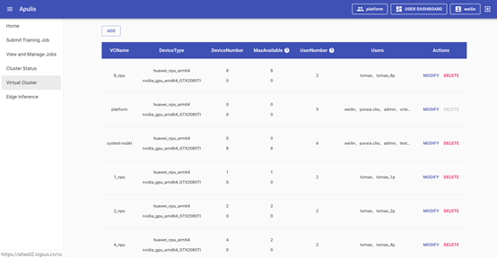
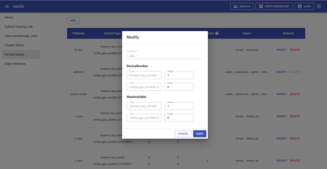

显示已配置的虚拟集群列表，见附图30。

​                                                                                                             图 30 virtual cluster列表

## 2.6.1   VC列表

列表内容包括VcName、DeviceType、DeviceNumber、MaxAvailable、UserNumber、Users和Acitons共4项。

VcName：VC的名称。

UserNumber：使用该VC的用户数量

DeviceType：该VC的AI计算芯片类型。

DeviceNumber：该VC的AI计算芯片的数量。

MaxAvailable：拥有该VC使用权的用户，只能使用该AI计算芯片的最大的数量，MaxAvailable永远小于或等于DeviceNumber。

Users：表示使用该VC的用户。

Acitons：显示操作列，包括修改和删除按钮。

 

## 2.6.2   新增VC

点击列表上方的ADD，打开新增VC页面，见附图31，输入VcName，设置DeviceNumber和MaxAvailable后保存，即可新增VC。VcName不能与已有的名称重复，DeviceNumber的值，不可超过剩余可用的AI计算芯片的数量。

​                                                                                                                        图 31 新增VC

## 2.6.3   修改VC

选择VC，点击列表中的MODIFY，打开修改VC页面，见附图32；修改VC时只能修改value参数，VcName不能编辑修改。【注意】如选择的VC有running、scheduling、killing、pausing状态的job，则无法修改VC。

​                                                                                                                            图 32 修改VC

## 2.6.4   删除VC

选择VC，点击删除，弹出删除确认页面，见附图33，点击delete后即删除VC，同时会删除该VC下的所有job。【注意】如选择的VC有running、scheduling、killing、pausing状态的job，则无法删除；当前所在的VC删除按钮置灰，无法删除。

​                                                                                                                             图 33 删除VC