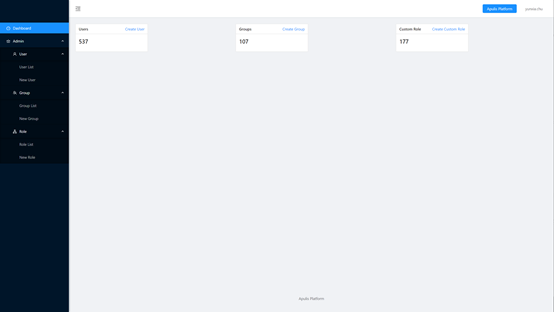
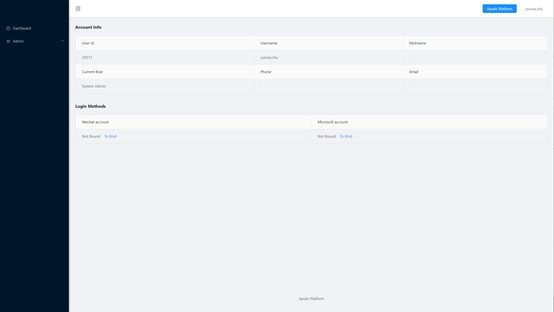
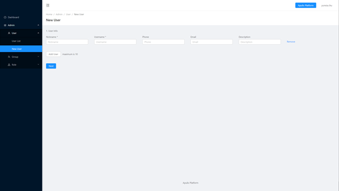
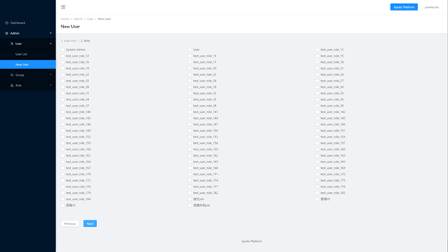
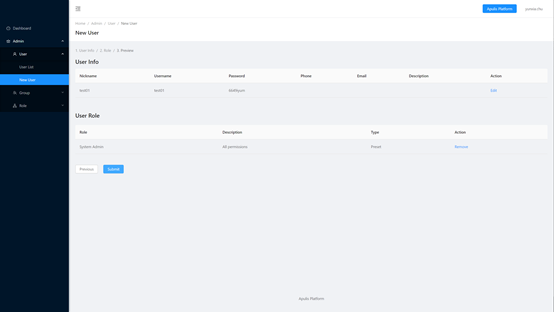
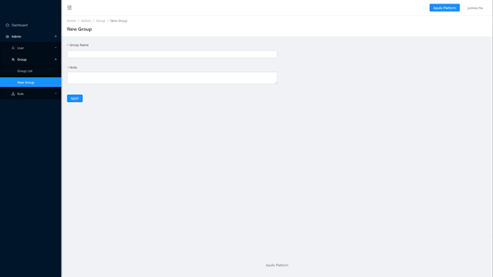
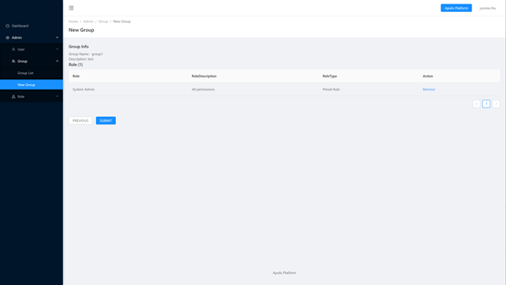
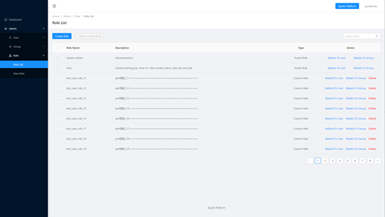

User Dashboard页面如图34所示，包括上方菜单栏、dashboard和Admin，其中Admin包括User、Group、Role。

​                                                                                                   图 34 User Dashboard

## 2.7.1 顶端菜单栏

顶端菜单栏包括Apulis Platform和用户名。

点击Apulis Platform后切换到深度学习平台，点击用户名后可选择Account info或者logout。选择Account info后打开用户详情页，见附图35，选择logout后退出登录，跳转到登录页面。

​                                                                                            图 35 account info-用户详情页

用户详情页包括Account Info和Login Methods，Account Info显示用户的基本信息，包括User Id、Username、Nickname、Current Role、Phone和Email，Login Methods显示是否已绑定Wetchat和Microsoft account，如未绑定，点击To Bind后跳转到绑定页面。

## 2.7.2 Dashboard

显示已有的用户数、用户组数和角色数，点击Create User后即可快捷跳转到新建User界面；点击Create Group后即可快捷跳转到新建Group页面；点击Create Custom Role后即可快捷跳转到新建Role页面。

## 2.7.3 User

包括User list和New User，User List展示已有的用户列表，点击Create User可创建新的用户。

### 2.7.3.1 用户列表

User List中包括Username、Nickname、Phone、Email、Action共5列，见附图36。

​                                                                                                        图 36 用户列表

Username：用户名，该字段是唯一的，不能重复。

Nickname：用户昵称。

Phone：电话号码。

Email：邮箱。

Action：操作列，包括编辑用户的角色、将用户关联到用户组和删除用户操作，其中拥有系统管理员角色的用户，不能修改此用户的角色，也不能删除此用户。

点击列表中的用户名或昵称可跳转到用户详情页，见附图37。

​                                                                                             图 37 用户详情页面

### 2.7.3.2 新建用户

创建用户时共分为3步，填写用户信息->关联角色->确认，见附图38-图40。

​                                                                                          图 38 新建用户-填写用户信息

昵称和用户名为必填字段，填写之后点击下一步，跳转到关联角色页面。也可以批量添加用户，最大数量不能超过10个。

​                                                                                                   图 39 新建用户-关联角色

关联角色时，至少需选择一个角色关联，点击next后跳转到预览页面，也可点击previous返回上一步。

​                                                                                                     图 40 新建用户-确认

展示新建用户的相关信息，点击Submit则新建用户，点击Previous则返回上一步。

## 2.7.4 Group

包括Group List和Create Group，Group List展示已有的用户组列表，点击Create Group可创建新的用户组。

### 2.7.4.1 用户组列表

Group List中包括Group Name、Description、Create Time、Action共4列，见附图41。

​                                                                                                       图 41 用户组列表

Group Name：用户组名称，该字段是唯一的，不能重复。

Description：用户组的描述。

Create Time：用户组的创建时间。

Actions：操作列，可以为用户组添加用户、删除用户组、指定可以使用的VC资源。

点击列表中的用户组名称后跳转到用户组详情页面，见附图42，显示用户组信息、用户组拥有的角色和用户组内的用户。

​                                                                                                      图 42 用户组详情页

### 2.7.4.2 新建用户组

创建用户时共分为3步，填写用户组信息->关联角色->确认，见附图43-图45。

​                                                                                             图 43 新建用户组-用户组信息

用户组名称和描述都为必填字段，填写后点击下一步，跳转到关联角色页面。

​                                                                                             图 44 新建用户组-关联角色

至少需选择一个角色关联，点击next后跳转到确认页面，也可点击previous返回上一步。

​                                                                                                     图 45 新建用户组-确认

展示新建的用户组相关信息，点击submit新建用户组，点击previous返回上一步。
## 2.7.5 Role

包括Role List和Create Role，Role List展示已有的角色列表，点击Create role可创建新的角色。

### 2.7.5.1 角色列表

Role List中包括Role Name、Description、Type、Action共4列，见附图46。

​                                                                                                             图 46 角色列表

Role Name：角色名称，该字段是唯一的，不能重复。

Description：角色的描述。

Type：角色的类型，角色类型分为预设角色和用户自定义角色两种。预设角色是系统默认创建的，不能删除。

Actions：操作列，可以进行关联用户、关联用户组和删除角色的操作。